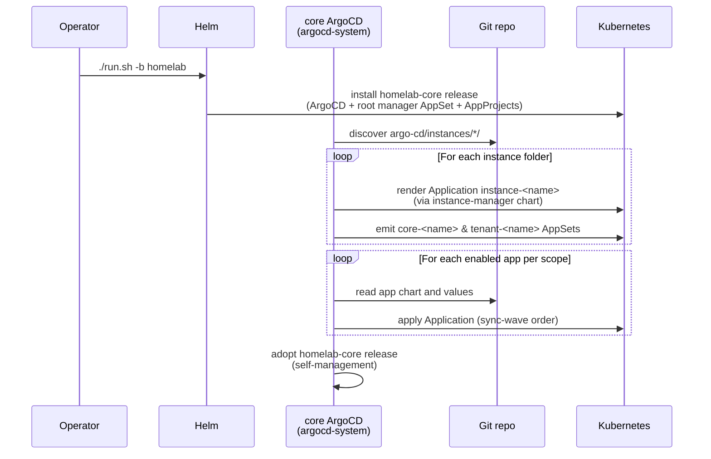
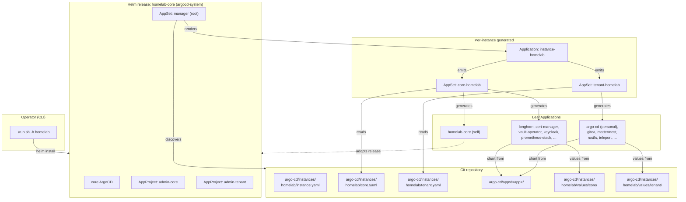
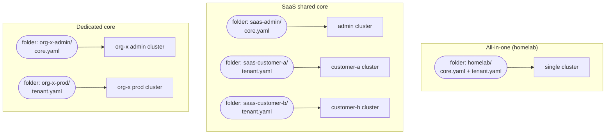

# Installation

The installation is performed in two phases:
1. **Infrastructure** deployment with [Ansible](https://www.ansible.com/) for gateway and K3s cluster setup
2. **Applications** deployment with [ArgoCD](https://argo-cd.readthedocs.io/) following a GitOps approach

## Prerequisites

Following tools need to be installed on the computer running the deployment:
- [ansible](https://ansible.com) *- infrastructure as code software tools.*
- [age](https://github.com/FiloSottile/age) *- simple, modern and secure encryption tool.*
- [helm](https://helm.sh/) *- Kubernetes package manager.*
- [htpasswd](https://httpd.apache.org/docs/current/programs/htpasswd.html) *- bcrypt password hashing (apache2-utils on Linux, ships with macOS).*
- [kubectl](https://kubernetes.io/docs/reference/kubectl/) *- Kubernetes command-line tool.*
- [sops](https://github.com/getsops/sops) *- simple and flexible tool for managing secrets.*
- [sshpass](https://sourceforge.net/projects/sshpass) *- non-interactive ssh password auth.*
- [yq](https://github.com/mikefarah/yq) *- portable command-line YAML, JSON, XML, CSV, TOML and properties processor.*

```sh
# Clone the repository
git clone --depth 1 https://github.com/this-is-tobi/homelab.git && cd ./homelab && rm -rf ./.git

# Copy inventory example to inventory
cp -R ./ansible/inventory-example ./ansible/inventory
```

> __*Notes*__:
>
> *PiHole and Wireguard installation can be ignored by setting `enabled: false` in [gateway group_vars](../ansible/inventory-example/group_vars/gateway.yml).*


## Settings

### Infrastructure

Update the [hosts file](../ansible/inventory-example/hosts.yml) and [group_vars files](../ansible/inventory-example/group_vars/) to provide the appropriate infrastructure settings.

To create admin access to the machines, it is required to provide their informations in the `group_vars/all.yml` file:
- Put user ssh public key in the inventory file, this will grant admin access to the infrastructure by adding `authorized_keys`.

### Applications (GitOps)

Applications are managed by a **two-level** ApplicationSet hierarchy:

1. The root `manager` ApplicationSet (shipped by `homelab-core`) discovers every folder under [./argo-cd/instances/](../argo-cd/instances/) and emits one Application per instance pointing at the [./argo-cd/apps/instance-manager](../argo-cd/apps/instance-manager) chart.
2. That chart in turn renders **two child ApplicationSets per instance** — `core-<instance>` and `tenant-<instance>` — that fan out into the actual leaf Applications.

Configuration is split per instance and per scope:

| Path                                                                                                                         | Purpose                                                                                                       |
| ---------------------------------------------------------------------------------------------------------------------------- | ------------------------------------------------------------------------------------------------------------- |
| [./argo-cd/instances/\<instance\>/instance.yaml](../argo-cd/instances/homelab/instance.yaml)                                 | Per-instance metadata: cluster destination, env, repos, AppProject bindings.                                  |
| [./argo-cd/instances/\<instance\>/core.yaml](../argo-cd/instances/homelab/core.yaml)                                         | Core tier app catalog (platform/infra/identity/observability/security).                                       |
| [./argo-cd/instances/\<instance\>/tenant.yaml](../argo-cd/instances/homelab/tenant.yaml)                                     | Tenant tier app catalog (user-facing services).                                                               |
| [./argo-cd/instances/\<instance\>/values/core/\<app\>.yaml](../argo-cd/instances/homelab/values/core/)                       | Per-instance Helm values for each core app.                                                                   |
| [./argo-cd/instances/\<instance\>/values/tenant/\<app\>.yaml](../argo-cd/instances/homelab/values/tenant/)                   | Per-instance Helm values for each tenant app.                                                                 |
| [./argo-cd/instances/\<instance\>/values/core/homelab-core.yaml](../argo-cd/instances/homelab/values/core/homelab-core.yaml) | Bootstrap values for core ArgoCD + the root `manager` AppSet + the `admin-core` / `admin-tenant` AppProjects. |
| [./argo-cd/apps/\<app\>/](../argo-cd/apps/)                                                                                  | Helm chart catalog (chart sources only — values live in the trees above).                                     |

To enable or disable a service for an instance, edit the matching `core.yaml` or `tenant.yaml` and flip the `"enabled"` field on the relevant entry.

Per-app overrides supported in the JSON catalogues (all optional):

| Field                | Default                                                  | Use case                                                                         |
| -------------------- | -------------------------------------------------------- | -------------------------------------------------------------------------------- |
| `chart`              | same as `app`                                            | Use a different chart directory under `argo-cd/apps/`.                           |
| `chartPath`          | `argo-cd/apps/<chart>`                                   | Point at a chart **outside** `argo-cd/apps/` (e.g. self-managed `homelab-core`). |
| `releaseName`        | same as `app`                                            | Adopt an existing helm release for self-management.                              |
| `namespace`          | `<prefix><app><suffix>`                                  | Pin to an explicit namespace (e.g. `argocd-system`).                             |
| `destination.server` | `instance.yaml.destination.server`                       | Target a different cluster (multi-cluster).                                      |
| `valuesPath`         | `argo-cd/instances/<instance>/values/<scope>/<app>.yaml` | Point to a non-conventional values file.                                         |
| `targetRevision`     | `instance.yaml.targetRevision`                           | Pin app to a specific git revision.                                              |
| `hook`               | `Sync`                                                   | Use as `PreSync` / `PostSync` hook.                                              |
| `syncWave`           | required                                                 | ArgoCD sync ordering.                                                            |

### Secrets Management

[Sops](https://github.com/getsops/sops) is used to encrypt sensitive values. These secrets are managed (encrypted/decrypted) using the wrapper script [run.sh](../run.sh) following the keys provided in [.sops.yaml](../.sops.yaml).

> *__Notes:__*
>
> *__Update Sops keys with your own__ but __leave the first age key blank__ as it is used by the cluster's automated key management system.*
>
> *Decrypt secrets by running `./run.sh -d` and encrypt secrets by running `./run.sh -e`, do not forget to re-encrypt secrets when changes are made.*

> __*Notes*__:
>
> *During setup, every password, token and so on are randomly generated and stored into Vault secrets.*


## Deploy

### Infrastructure

Deploy gateway and K3s cluster using the Ansible playbook:

```sh
# Update Ansible collections and deploy infrastructure
./run.sh -p ./ansible/install.yml -u -k

# Or with specific tags
./run.sh -p ./ansible/install.yml -t gateway   # Deploy gateway only
./run.sh -p ./ansible/install.yml -t k3s       # Deploy K3s cluster only
```

The `-k` flag fetches the kubeconfig from the master node and merges it into your local kubeconfig.

### Applications (GitOps)

Once the infrastructure is ready, bootstrap the GitOps stack with a single command:

```sh
# Set kubectl context
kubectl config use-context homelab

# Bootstrap (or upgrade) the homelab instance
./run.sh -b homelab
```

This installs the `homelab-core` Helm release in the `argocd-system` namespace, which contains:
- The **core ArgoCD** instance (engine; not user-facing).
- The root `manager` ApplicationSet (discovers every instance under `argo-cd/instances/*`).
- The `admin-core` and `admin-tenant` AppProjects.

The root manager then renders one `instance-<name>` Application per discovered folder. That Application points at the [./argo-cd/apps/instance-manager](../argo-cd/apps/instance-manager) chart, which produces two child ApplicationSets (`core-<name>` and `tenant-<name>`). The first sync wave (-10) reconciles `homelab-core` itself onto the chart in git — the bootstrap release is then **self-managed**.


```mermaid
sequenceDiagram
    participant Op as Operator
    participant Helm
    participant Core as core ArgoCD<br/>(argocd-system)
    participant Git as Git repo
    participant K8s as Kubernetes
    Op->>Helm: ./run.sh -b homelab
    Helm->>K8s: install homelab-core release<br/>(ArgoCD + root manager AppSet + AppProjects)
    Core->>Git: discover argo-cd/instances/*/
    loop For each instance folder
        Core->>K8s: render Application instance-<name><br/>(via instance-manager chart)
        Core->>K8s: emit core-<name> & tenant-<name> AppSets
    end
    loop For each enabled app per scope
        Core->>Git: read app chart and values
        Core->>K8s: apply Application (sync-wave order)
    end
    Core->>Core: adopt homelab-core release<br/>(self-management)
```

> __*Notes*__:
>
> *Multiple tags can be passed as follows:* `./run.sh -p ./ansible/install.yml -t gateway,k3s`
>
> *First gateway init can take a long time to run because of OpenVPN key generation (5-10min).*
>
> *Bootstrap admin password: pass `ARGOCD_ADMIN_PASSWORD=mypass ./run.sh -b homelab` to set it explicitly. Without this var, the ArgoCD chart auto-generates a password and stores it in `argocd-initial-admin-secret`; the script prints it at the end of the run.*
>
> *OIDC for the core ArgoCD is intentionally disabled at bootstrap. Enable it in [argo-cd/instances/homelab/values/core/homelab-core.yaml](../argo-cd/instances/homelab/values/core/homelab-core.yaml) once Keycloak is ready (uncomment the `oidc.config` block and provide the client secret out-of-band).*


## Destroy

It is possible to cleanly destroy the K3s cluster by running:

```sh
# Destroy cluster
./run.sh -p ./ansible/install.yml -t k3s-destroy
```


## Architecture

### Two ArgoCD instances

The cluster runs **two** ArgoCD instances with very different roles:

| Instance     | Namespace       | Purpose                                                                                                                               |
| ------------ | --------------- | ------------------------------------------------------------------------------------------------------------------------------------- |
| **core**     | `argocd-system` | The engine. Runs the `manager` ApplicationSet that drives every other app. Not user-facing.                                           |
| **personal** | `argo-cd`       | A user-facing sandbox at `gitops.<domain>`. Driven by core, but has no `manager` itself — used through the UI for ad-hoc deployments. |

Both instances are deployed from the same chart at [argo-cd/apps/argo-cd/](../argo-cd/apps/argo-cd/), differentiated by their per-instance values files.

### App-of-apps flow


```mermaid
flowchart TB
    subgraph cli["Operator (CLI)"]
        runsh["./run.sh -b homelab"]
    end

    subgraph bootstrap["Helm release: homelab-core (argocd-system)"]
        coreArgo["core ArgoCD"]
        projC["AppProject: admin-core"]
        projT["AppProject: admin-tenant"]
        rootAS["AppSet: manager (root)"]
    end

    subgraph generated["Per-instance generated"]
        instApp["Application: instance-homelab"]
        coreAS["AppSet: core-homelab"]
        tenantAS["AppSet: tenant-homelab"]
    end

    subgraph apps["Leaf Applications"]
        selfApp["homelab-core (self)"]
        coreApps["longhorn, cert-manager,<br/>vault-operator, keycloak,<br/>prometheus-stack, ..."]
        tenantApps["argo-cd (personal),<br/>gitea, mattermost,<br/>rustfs, teleport, ..."]
    end

    subgraph git["Git repository"]
        instYaml["argo-cd/instances/<br/>homelab/instance.yaml"]
        coreJson["argo-cd/instances/<br/>homelab/core.yaml"]
        tenantJson["argo-cd/instances/<br/>homelab/tenant.yaml"]
        appCharts["argo-cd/apps/&lt;app&gt;/"]
        coreVals["argo-cd/instances/<br/>homelab/values/core/"]
        tenantVals["argo-cd/instances/<br/>homelab/values/tenant/"]
    end

    runsh -->|helm install| bootstrap
    rootAS -->|discovers| git
    rootAS -->|renders| instApp
    instApp -->|emits| coreAS
    instApp -->|emits| tenantAS
    coreAS -->|reads| coreJson
    tenantAS -->|reads| tenantJson
    coreAS -->|generates| selfApp
    coreAS -->|generates| coreApps
    tenantAS -->|generates| tenantApps
    selfApp -.->|adopts release| bootstrap
    coreApps -->|chart from| appCharts
    coreApps -->|values from| coreVals
    tenantApps -->|chart from| appCharts
    tenantApps -->|values from| tenantVals
```

Adding a new instance is purely declarative — just create a folder under [argo-cd/instances/](../argo-cd/instances/) (with `instance.yaml` + `core.yaml` + `tenant.yaml`) and a matching `argo-cd/instances/<name>/values/{core,tenant}/` tree. The root manager picks it up on its next reconciliation:

1. Create `argo-cd/instances/<name>/instance.yaml` (cluster destination, repos, project bindings).
2. Create `argo-cd/instances/<name>/core.yaml` and/or `argo-cd/instances/<name>/tenant.yaml`.
3. Create `argo-cd/instances/<name>/values/core/` and/or `argo-cd/instances/<name>/values/tenant/` with at least a `homelab-core.yaml` (under `core/`) for the self-managed bootstrap App when shipping core on that cluster.
4. Bootstrap the **first** instance with `./run.sh -b <name>` against its target cluster; subsequent instances are then picked up automatically by the existing root manager.

### Topologies

The two-level pattern accommodates very different deployment models, all driven by the same root manager and chart catalog:


```mermaid
flowchart TB
    subgraph t1["All-in-one (homelab)"]
        h1(["folder: homelab/<br/>core.yaml + tenant.yaml"]) --> c1["single cluster"]
    end
    subgraph t2["SaaS shared core"]
        a2(["folder: saas-admin/<br/>core.yaml"]) --> ca["admin cluster"]
        b2a(["folder: saas-customer-a/<br/>tenant.yaml"]) --> cca["customer-a cluster"]
        b2b(["folder: saas-customer-b/<br/>tenant.yaml"]) --> ccb["customer-b cluster"]
    end
    subgraph t3["Dedicated core"]
        a3(["folder: org-x-admin/<br/>core.yaml"]) --> ox1["org-x admin cluster"]
        b3(["folder: org-x-prod/<br/>tenant.yaml"]) --> ox2["org-x prod cluster"]
    end
```

| Topology             | Folders on disk                                                  | Where things run                                                                   |
| -------------------- | ---------------------------------------------------------------- | ---------------------------------------------------------------------------------- |
| All-in-one (homelab) | `homelab/` with both `core.yaml` and `tenant.yaml`               | Single cluster, single ArgoCD, both AppSets land on `in-cluster`.                  |
| SaaS shared core     | `saas-admin/` (core only) + N × `saas-customer-*/` (tenant only) | Admin cluster runs the core stack; each customer gets its own cluster for tenants. |
| Dedicated core       | One pair per org: `<org>-admin/` (core) + `<org>-prod/` (tenant) | Strict per-org isolation: dedicated admin cluster + dedicated app cluster.         |

The target cluster for each instance is set in its `instance.yaml.destination.server`; remote clusters are registered in ArgoCD via `Cluster` secrets (managed via Vault/VSO if desired).

### Tier-flexible apps

A handful of apps don't naturally belong in a single tier — they're needed *wherever workloads run*, regardless of whether the cluster is acting as a "core/admin" cluster or a "tenant/apps" cluster. The catalog lists them in **both** [`_example/core.yaml`](../argo-cd/instances/_example/core.yaml) and [`_example/tenant.yaml`](../argo-cd/instances/_example/tenant.yaml) with appropriate per-tier `syncWave`s; for any concrete instance you enable the entry in **exactly one** tier and leave the other disabled.

| App                    | Where to enable                                                                     |
| ---------------------- | ----------------------------------------------------------------------------------- |
| `cert-manager`         | Wherever Ingress / TLS certificates are issued.                                     |
| `ingress-nginx`        | Wherever an ingress controller is needed.                                           |
| `keycloak`             | Wherever the SSO IdP runs (often tenant in SaaS, core in all-in-one).               |
| `kubernetes-dashboard` | Wherever cluster admins want a UI; one per cluster.                                 |
| `longhorn`             | Wherever block storage is needed (typically every cluster with stateful workloads). |
| `prometheus-stack`     | Wherever observability is collected (often core in shared topologies).              |
| `teleport`             | Wherever the access proxy runs.                                                     |
| `vault`                | Wherever the secrets backend lives (often co-located with workloads consuming it).  |

> Enabling a tier-flexible app in **both** tiers of the same instance would create two `Application`s with the same name and is not supported. The `_example` template ships with everything disabled to make this an explicit, deliberate choice.

### Splitting infra and values across two repositories

Per-instance values live alongside the rest of the instance metadata (`argo-cd/instances/<inst>/values/{core,tenant}/<app>.yaml`). For most setups keeping everything in a single repo is the simplest option.

If you need to keep the chart catalog public while keeping per-instance values (which often contain hostnames, secrets references, OIDC client IDs, etc.) in a private repository, the `instance-manager` chart supports it natively:

```yaml
# argo-cd/instances/<inst>/instance.yaml
repoURL: https://github.com/this-is-tobi/homelab.git          # public: charts + this file
valuesRepoURL: https://github.com/<you>/homelab-private.git    # private: values tree only
targetRevision: main
```

When `valuesRepoURL` is set, the child AppSets attach **two** git sources to every generated `Application`:

- `repoURL` (the chart source) — used to fetch `argo-cd/apps/<app>/`.
- `valuesRepoURL` (the `$values` ref) — used to fetch `argo-cd/instances/<inst>/values/<tier>/<app>.yaml`.

In the values repository, mirror the path layout exactly:

```
homelab-private/                                # your private repo root
└─ argo-cd/
   └─ instances/
      └─ <inst>/
         └─ values/
            ├─ core/<app>.yaml
            └─ tenant/<app>.yaml
```

Per-app overrides also exist if a single app needs a different layout — `valuesPath` overrides the whole path, useful for charts that ship in their own repository entirely.

### Sync waves

Apps are reconciled in `syncWave` order. Default ordering for the homelab instance:

| Wave | Tier   | Apps                                                                          |
| ---- | ------ | ----------------------------------------------------------------------------- |
| -10  | core   | `homelab-core` (self)                                                         |
| 0    | core   | `longhorn`                                                                    |
| 10   | core   | `cert-manager`, `ingress-nginx`, `vault-operator`                             |
| 20   | core   | `cloudnative-pg`, `sops`, `vault`                                             |
| 30   | core   | `keycloak`                                                                    |
| 50   | core   | `prometheus-stack`, `trivy-operator`                                          |
| 60   | core   | `system-upgrade`                                                              |
| 100  | tenant | `argo-cd` (personal)                                                          |
| 110  | tenant | `actions-runner-controller`, `gitea`, `mattermost`, `rustfs`, `teleport`, ... |
| 200  | tenant | `homepage`                                                                    |

### Core Services

Core services provide the foundation for the platform:
- **Longhorn** *- storage management in the cluster.*
- **Ingress-NGINX** *- ingress controller to expose services.*
- **Cert-Manager** *- certificate management for TLS.*
- **Vault Operator** *- secret management for services deployments.*
- **ArgoCD** *- deployment management following GitOps.*
- **CloudNative-PG** *- PostgreSQL operator for databases.*

### Platform Services

Platform services are deployed on top of core services:
- **Keycloak** *- identity and access management (SSO).*
- **Gitea** *- self-hosted Git service.*
- **Harbor** *- container registry.*
- **Mattermost** *- team communication.*
- **And more...*


## Known issues

At the moment, `mattermost` and `outline` images are not `arm64` compatible so their deployment are using custom mirror image with compatibility (see. [this repo](https://github.com/this-is-tobi/multiarch-mirror) and associated ArgoCD applications).

The [official Harbor helm chart](https://artifacthub.io/packages/helm/harbor/harbor) cannot be used due to arm64 incompatibility, the [Bitnami distribution](https://artifacthub.io/packages/helm/bitnami/harbor) is used instead.
