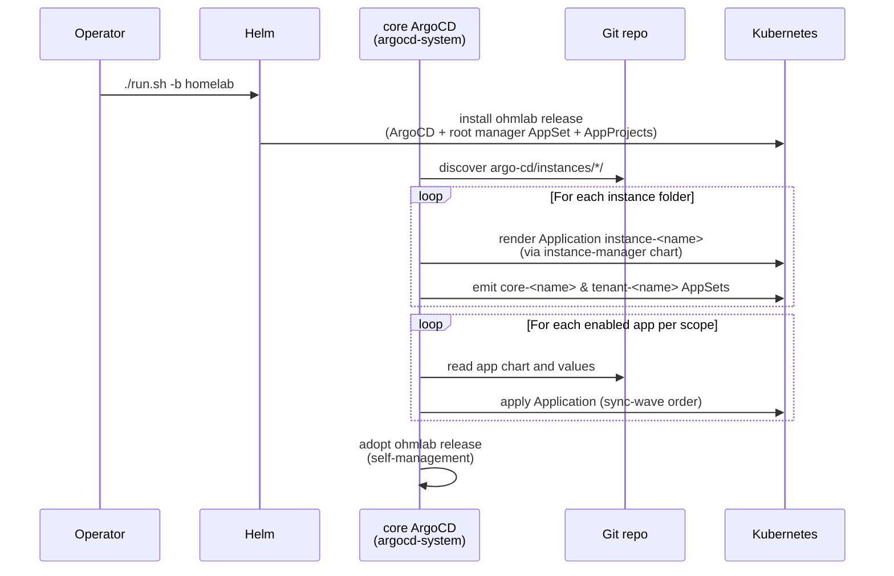
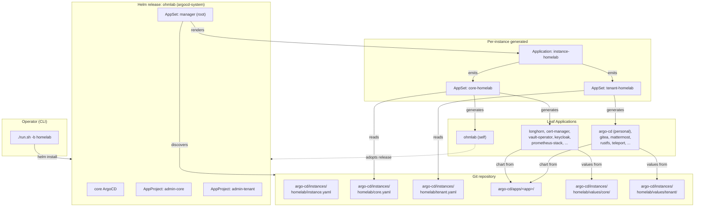
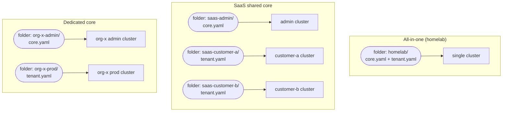

# Installation

The installation is performed in two phases:
1. **Infrastructure** deployment with [Ansible](https://www.ansible.com/) for gateway and K3s cluster setup
2. **Applications** deployment with [ArgoCD](https://argo-cd.readthedocs.io/) following a GitOps approach

> [!TIP]
> **Already have a cluster?** Phase 1 is optional. If you run managed Kubernetes (EKS/GKE/AKS/DOKS/...) or any existing cluster, skip straight to [Applications (GitOps)](#applications-gitops) — the `argo-cd/` tree only needs a working kubeconfig and does not depend on Ansible, K3s, or the gateway host. See [Using an existing cluster](#using-an-existing-cluster) for what to adjust.

## Prerequisites

Following tools need to be installed on the computer running the deployment:
- [ansible](https://ansible.com) *- infrastructure as code software tools.*
- [age](https://github.com/FiloSottile/age) *- simple, modern and secure encryption tool.*
- [helm](https://helm.sh/) *- Kubernetes package manager.*
- [htpasswd](https://httpd.apache.org/docs/current/programs/htpasswd.html) *- bcrypt password hashing (apache2-utils on Linux, ships with macOS).*
- [kubectl](https://kubernetes.io/docs/reference/kubectl/) *- Kubernetes command-line tool.*
- [sops](https://github.com/getsops/sops) *- simple and flexible tool for managing secrets.*
- [sshpass](https://sourceforge.net/projects/sshpass) *- non-interactive ssh password auth.*
- [yq](https://github.com/mikefarah/yq) *- portable command-line YAML, JSON, XML, CSV, TOML and properties processor.*

```sh
# Clone the repository
git clone --depth 1 https://github.com/this-is-tobi/homelab.git && cd ./homelab && rm -rf ./.git

# Copy inventory example to inventory
cp -R ./ansible/inventory-example ./ansible/inventory
```

### Ansible Vault

Sensitive values (passwords, tokens, certificates) are stored in `ansible/inventory/group_vars/vault.yml` and encrypted at rest with [ansible-vault](https://docs.ansible.com/ansible/latest/vault_guide/index.html).

1. Create a vault password file (never committed — already in `.gitignore`):

```sh
# Generate a strong random password
openssl rand -base64 32 > ./ansible/.vault_password
```

2. Fill in the secrets in `ansible/inventory/group_vars/vault.yml`:

```yaml
vault_ansible_password: <ssh-password>
vault_pihole_password: "" # auto-generated if empty
vault_wireguard_password: "" # auto-generated if empty
vault_k3s_token: "" # populated during cluster bootstrap
vault_k3s_ca_data: "" # populated during cluster bootstrap
```

3. Encrypt the vault file:

```sh
cd ansible && ansible-vault encrypt inventory/group_vars/vault.yml
```

> **Notes**:
>
> *To edit secrets later: `ansible-vault edit inventory/group_vars/vault.yml`*
>
> *Auto-generated values are created once and persisted in gitignored files next to the inventory — `inventory/group_vars/.pihole_password`, `.wireguard_password` (by the gateway roles) and `.pi_password` (by `scripts/setup-pi.sh`) — and reused on later runs. Copy them into the vault when you want them under version control.*
>
> *The vault password file path is configured in `ansible.cfg` (`vault_password_file = .vault_password`).*

> __*Notes*__:
>
> *PiHole and Wireguard installation can be ignored by setting `enabled: false` in [gateway group_vars](../ansible/inventory-example/group_vars/gateway.yml).*

## Settings

### Infrastructure

Update the [hosts file](../ansible/inventory-example/hosts.yml) and [group_vars files](../ansible/inventory-example/group_vars/) to provide the appropriate infrastructure settings.

All sensitive values are indirected through `vault_*` variables in `group_vars/vault.yml` (see [Ansible Vault](#ansible-vault) above). Non-secret settings are in `all.yml`, `gateway.yml` and `k3s.yml`.

To create admin access to the machines, provide admin user information in `group_vars/all.yml` (`adminUsers`). Each entry creates:
- a **dedicated OS account** on every host with the given `sshPubKey` in its own `authorized_keys` (attributable logins — keys are never appended to the shared `ansible_user` account), plus optional passwordless sudo with `sudo: true`;
- a **Kubernetes user** (x509 client certificate + kubeconfig) with the RBAC tier set by `role`: `namespace-admin` (default — a personal namespace with full rights inside it), `cluster-admin`, or `view`.

`state: absent` removes the OS account, the SSH key and all Kubernetes RBAC. Note that the issued client certificate keeps *authenticating* until it expires (Kubernetes has no CRL) — deleting the bindings is what revokes *authorization*. Certificates are valid one year and re-issued automatically when a run finds them within 30 days of expiry.

### Applications (GitOps)

Applications are managed by a **two-level** ApplicationSet hierarchy:

1. The root `manager` ApplicationSet (shipped by `ohmlab`) discovers every folder under [./argo-cd/instances/](../argo-cd/instances/) and emits one Application per instance pointing at the [./argo-cd/apps/instance-manager](../argo-cd/apps/instance-manager) chart.
2. That chart in turn renders **two child ApplicationSets per instance** — `core-<instance>` and `tenant-<instance>` — that fan out into the actual leaf Applications.

Configuration is split per instance and per scope:

| Path                                                                                                             | Purpose                                                                                                       |
| ---------------------------------------------------------------------------------------------------------------- | ------------------------------------------------------------------------------------------------------------- |
| [./argo-cd/instances/\<instance\>/instance.yaml](../argo-cd/instances/homelab/instance.yaml)                     | Per-instance metadata: cluster destination, env, repos, AppProject bindings.                                  |
| [./argo-cd/instances/\<instance\>/core.yaml](../argo-cd/instances/homelab/core.yaml)                             | Core tier app catalog (platform/infra/identity/observability/security).                                       |
| [./argo-cd/instances/\<instance\>/tenant.yaml](../argo-cd/instances/homelab/tenant.yaml)                         | Tenant tier app catalog (user-facing services).                                                               |
| [./argo-cd/instances/\<instance\>/values/core/\<app\>.yaml](../argo-cd/instances/homelab/values/core/)           | Per-instance Helm values for each core app.                                                                   |
| [./argo-cd/instances/\<instance\>/values/tenant/\<app\>.yaml](../argo-cd/instances/homelab/values/tenant/)       | Per-instance Helm values for each tenant app.                                                                 |
| [./argo-cd/instances/\<instance\>/values/core/ohmlab.yaml](../argo-cd/instances/homelab/values/core/ohmlab.yaml) | Bootstrap values for core ArgoCD + the root `manager` AppSet + the `admin-core` / `admin-tenant` AppProjects. |
| [./argo-cd/apps/\<app\>/](../argo-cd/apps/)                                                                      | Helm chart catalog (chart sources only — values live in the trees above).                                     |

To enable or disable a service for an instance, edit the matching `core.yaml` or `tenant.yaml` and flip the `"enabled"` field on the relevant entry.

Per-app overrides supported in the JSON catalogues (all optional):

| Field                | Default                                                  | Use case                                                                   |
| -------------------- | -------------------------------------------------------- | -------------------------------------------------------------------------- |
| `chart`              | same as `app`                                            | Use a different chart directory under `argo-cd/apps/`.                     |
| `chartPath`          | `argo-cd/apps/<chart>`                                   | Point at a chart **outside** `argo-cd/apps/` (e.g. self-managed `ohmlab`). |
| `releaseName`        | same as `app`                                            | Adopt an existing helm release for self-management.                        |
| `namespace`          | `<prefix><app><suffix>`                                  | Pin to an explicit namespace (e.g. `argocd-system`).                       |
| `destination.server` | `instance.yaml.destination.server`                       | Target a different cluster (multi-cluster).                                |
| `valuesPath`         | `argo-cd/instances/<instance>/values/<scope>/<app>.yaml` | Point to a non-conventional values file.                                   |
| `targetRevision`     | `instance.yaml.targetRevision`                           | Pin app to a specific git revision.                                        |
| `syncWave`           | required                                                 | ArgoCD sync ordering.                                                      |

> **`syncWave` semantics**: on an AppSet-generated Application, the sync-wave annotation alone orders **nothing** — apps sync in parallel and converge by retry. To actually enforce the ordering, enable progressive sync (`progressiveSync.enabled: true` in the `instance-manager` chart values); it maps waves onto ApplicationSet `RollingSync` steps. Requires the alpha `ApplicationSetProgressiveSyncs` feature gate, which the `ohmlab` chart enables on the core ArgoCD.

### Secrets Management

[Sops](https://github.com/getsops/sops) is used to encrypt sensitive values. These secrets are managed (encrypted/decrypted) using the wrapper script [run.sh](../run.sh) following the keys provided in [.sops.yaml](../.sops.yaml).

> *__Notes:__*
>
> *__Update the Sops keys in `.sops.yaml` with your own__: the first `age` entry must be the public key of the age keypair used by the in-cluster sops-secrets-operator (so the cluster can decrypt), and the PGP entry (or additional age entries) should be your own operator keys for local editing. The keys committed in this repo belong to this repo's own cluster — replace both.*
>
> *Decrypt secrets by running `./run.sh -d` and encrypt secrets by running `./run.sh -e`, do not forget to re-encrypt secrets when changes are made.*

> __*Notes*__:
>
> *During setup, every password, token and so on are randomly generated and stored into Vault secrets.*

## Deploy

### Infrastructure

Deploy gateway and K3s cluster using the Ansible playbook:

```sh
# Update Ansible collections and deploy infrastructure
./run.sh -p ./ansible/install.yml -u -k

# Or with specific tags
./run.sh -p ./ansible/install.yml -t gateway   # Deploy gateway only
./run.sh -p ./ansible/install.yml -t k3s       # Deploy K3s cluster only
```

The `-k` flag fetches the kubeconfig from the master node and merges it into your local kubeconfig.

### Applications (GitOps)

Once the infrastructure is ready, bootstrap the GitOps stack with a single command:

```sh
# Set kubectl context
kubectl config use-context homelab

# Bootstrap (or upgrade) the homelab instance
./run.sh -b homelab
```

This installs the `ohmlab` Helm release in the `argocd-system` namespace, which contains:
- The **core ArgoCD** instance (engine; not user-facing).
- The root `manager` ApplicationSet (discovers every instance under `argo-cd/instances/*`).
- The `admin-core` and `admin-tenant` AppProjects.

The root manager then renders one `instance-<name>` Application per discovered folder. That Application points at the [./argo-cd/apps/instance-manager](../argo-cd/apps/instance-manager) chart, which produces two child ApplicationSets (`core-<name>` and `tenant-<name>`). The first sync wave (-10) reconciles `ohmlab` itself onto the chart in git — the bootstrap release is then **self-managed**.


```mermaid
sequenceDiagram
    participant Op as Operator
    participant Helm
    participant Core as core ArgoCD<br/>(argocd-system)
    participant Git as Git repo
    participant K8s as Kubernetes
    Op->>Helm: ./run.sh -b homelab
    Helm->>K8s: install ohmlab release<br/>(ArgoCD + root manager AppSet + AppProjects)
    Core->>Git: discover argo-cd/instances/*/
    loop For each instance folder
        Core->>K8s: render Application instance-<name><br/>(via instance-manager chart)
        Core->>K8s: emit core-<name> & tenant-<name> AppSets
    end
    loop For each enabled app per scope
        Core->>Git: read app chart and values
        Core->>K8s: apply Application (sync-wave order)
    end
    Core->>Core: adopt ohmlab release<br/>(self-management)
```

> __*Notes*__:
>
> *Multiple tags can be passed as follows:* `./run.sh -p ./ansible/install.yml -t gateway,k3s`
>
> *First gateway init can take a long time to run because of OpenVPN key generation (5-10min).*
>
> *Bootstrap admin password: pass `ARGOCD_ADMIN_PASSWORD=mypass ./run.sh -b homelab` to set it explicitly. Without this var, the ArgoCD chart auto-generates a password and stores it in `argocd-initial-admin-secret`; the script prints it at the end of the run.*
>
> *OIDC for the core ArgoCD is intentionally disabled at bootstrap. Enable it in [argo-cd/instances/homelab/values/core/ohmlab.yaml](../argo-cd/instances/homelab/values/core/ohmlab.yaml) once Keycloak is ready (uncomment the `oidc.config` block and provide the client secret out-of-band).*

### Using an existing cluster

The GitOps layer (`argo-cd/`) is independent of how the cluster was created — it only needs a kubeconfig with cluster-admin. On managed Kubernetes (EKS/GKE/AKS/...) or any pre-existing cluster, skip the Ansible phase entirely and run `./run.sh -b <instance>` against your context.

Create your own instance folder rather than reusing `homelab` (which is this repo's own cluster, full of environment-specific values) — copy [argo-cd/instances/_example](../argo-cd/instances/_example) and see [Adding a new instance](#topologies). Points worth checking for a non-K3s cluster:

- **Storage** — `longhorn` assumes bare-metal disks. On a cloud provider, disable it and use the provider's own `StorageClass` (set it as default, or set `storageClass` explicitly on the apps that request one).
- **Ingress exposure** — the `traefik` app's Service is type `LoadBalancer`. A cloud provider assigns a real external IP automatically, so drop the `spec.externalIPs` list this repo uses (that exists only because it runs bare metal without an LB controller).
- **CNI** — managed clusters ship their own; leave the `cilium` app disabled. Read the CNI caveat at the top of any `templates/networkpolicy.yaml` before enabling `networkPolicy` — the rules were verified against Cilium and rely on three CNI-specific behaviours.
- **Pod/service CIDRs** — anything referencing `10.42.0.0/16` / `10.45.0.0/16` / `10.43.0.0/16` (NetworkPolicy `ipBlock` rules, `lanOnly.sourceRange`, crowdsec's `allowed_ranges`) must match your cluster's actual ranges.
- **Node labels** — apps pinning workloads with `nodeSelector: {node-type: worker}` (CNPG databases, Vault) need that label to exist, or the selector removed.
- **Gateway-host services** — HAProxy, PiHole, WireGuard and the gateway CrowdSec engine are Ansible-managed Docker services on a separate host. They have no in-cluster equivalent; ignore them unless you replicate that setup.

## Destroy

It is possible to cleanly destroy the K3s cluster by running:

```sh
# Destroy cluster
./run.sh -p ./ansible/install.yml -t k3s-destroy
```

## Maintenance

### OS upgrades

Run an OS package upgrade on all managed hosts (gateway + K3s nodes), rebooting only if required:

```sh
./run.sh -p ./ansible/install.yml -t os-upgrade
```

### Debian major version upgrade

Upgrade all hosts in-place from one Debian release to the next (e.g. bookworm → trixie). K3s nodes are automatically **drained** before the upgrade and **uncordoned** after reboot. Hosts are processed one at a time (`serial: 1`).

1. Set the target release in `inventory/group_vars/all.yml` (or pass it as extra var):

```yaml
common_dist_upgrade_target_release: trixie
```

2. Run the dist-upgrade:

```sh
./run.sh -p ./ansible/install.yml -t dist-upgrade
```

> **Notes**:
>
> *Hosts already running the target release are automatically skipped.*
>
> *Ensure `kubectl` is configured locally — the drain/uncordon commands run from your workstation.*
>
> *After a major upgrade, re-run the full infra playbook to reconcile Docker repos and other codename-dependent configuration: `./run.sh -p ./ansible/install.yml -u`*

### Ansible collection updates

Update pinned Ansible Galaxy collections to the latest compatible version before running a playbook:

```sh
./run.sh -p ./ansible/install.yml -u
```

Collection version ranges are pinned in [ansible/collections/requirements.yml](../ansible/collections/requirements.yml). Bump the major range when upgrading to a new major release.

### Ansible vault

Edit encrypted secrets:

```sh
cd ansible && ansible-vault edit inventory/group_vars/vault.yml
```

### Docker image updates (gateway)

Image versions for gateway services (HAProxy, PiHole, WireGuard) are managed in `inventory/group_vars/gateway.yml`. Update the `version` field and re-run the gateway playbook:

```sh
./run.sh -p ./ansible/install.yml -t gateway
```

### K3s version updates

K3s patch-level upgrades are handled automatically in-cluster by the [system-upgrade-controller](https://github.com/rancher/system-upgrade-controller). For major/minor version bumps:

1. Update `k3sVersion` in `inventory/group_vars/k3s.yml`.
2. Re-deploy: `./run.sh -p ./ansible/install.yml -t k3s`

### Kubernetes application updates

Application chart versions are managed via GitOps — update the Helm chart version in the relevant `argo-cd/apps/<app>/Chart.yaml` and push. ArgoCD auto-syncs the change.

## Architecture

### Two ArgoCD instances

The cluster runs **two** ArgoCD instances with very different roles:

| Instance     | Namespace       | Purpose                                                                                                                               |
| ------------ | --------------- | ------------------------------------------------------------------------------------------------------------------------------------- |
| **core**     | `argocd-system` | The engine. Runs the `manager` ApplicationSet that drives every other app. Not user-facing.                                           |
| **personal** | `argo-cd`       | A user-facing sandbox at `gitops.<domain>`. Driven by core, but has no `manager` itself — used through the UI for ad-hoc deployments. |

Both instances are deployed from the same chart at [argo-cd/apps/argo-cd/](../argo-cd/apps/argo-cd/), differentiated by their per-instance values files.

### App-of-apps flow


```mermaid
flowchart TB
    subgraph cli["Operator (CLI)"]
        runsh["./run.sh -b homelab"]
    end

    subgraph bootstrap["Helm release: ohmlab (argocd-system)"]
        coreArgo["core ArgoCD"]
        projC["AppProject: admin-core"]
        projT["AppProject: admin-tenant"]
        rootAS["AppSet: manager (root)"]
    end

    subgraph generated["Per-instance generated"]
        instApp["Application: instance-homelab"]
        coreAS["AppSet: core-homelab"]
        tenantAS["AppSet: tenant-homelab"]
    end

    subgraph apps["Leaf Applications"]
        selfApp["ohmlab (self)"]
        coreApps["longhorn, cert-manager,<br/>vault-operator, keycloak,<br/>prometheus-stack, ..."]
        tenantApps["argo-cd (personal),<br/>gitea, mattermost,<br/>rustfs, teleport, ..."]
    end

    subgraph git["Git repository"]
        instYaml["argo-cd/instances/<br/>homelab/instance.yaml"]
        coreJson["argo-cd/instances/<br/>homelab/core.yaml"]
        tenantJson["argo-cd/instances/<br/>homelab/tenant.yaml"]
        appCharts["argo-cd/apps/&lt;app&gt;/"]
        coreVals["argo-cd/instances/<br/>homelab/values/core/"]
        tenantVals["argo-cd/instances/<br/>homelab/values/tenant/"]
    end

    runsh -->|helm install| bootstrap
    rootAS -->|discovers| git
    rootAS -->|renders| instApp
    instApp -->|emits| coreAS
    instApp -->|emits| tenantAS
    coreAS -->|reads| coreJson
    tenantAS -->|reads| tenantJson
    coreAS -->|generates| selfApp
    coreAS -->|generates| coreApps
    tenantAS -->|generates| tenantApps
    selfApp -.->|adopts release| bootstrap
    coreApps -->|chart from| appCharts
    coreApps -->|values from| coreVals
    tenantApps -->|chart from| appCharts
    tenantApps -->|values from| tenantVals
```

Adding a new instance is purely declarative — just create a folder under [argo-cd/instances/](../argo-cd/instances/) (with `instance.yaml` + `core.yaml` + `tenant.yaml`) and a matching `argo-cd/instances/<name>/values/{core,tenant}/` tree. The root manager picks it up on its next reconciliation:

1. Create `argo-cd/instances/<name>/instance.yaml` (cluster destination, repos, project bindings).
2. Create `argo-cd/instances/<name>/core.yaml` and/or `argo-cd/instances/<name>/tenant.yaml`.
3. Create `argo-cd/instances/<name>/values/core/` and/or `argo-cd/instances/<name>/values/tenant/` with at least a `ohmlab.yaml` (under `core/`) for the self-managed bootstrap App when shipping core on that cluster.
4. Bootstrap the **first** instance with `./run.sh -b <name>` against its target cluster; subsequent instances are then picked up automatically by the existing root manager.

### Topologies

The two-level pattern accommodates very different deployment models, all driven by the same root manager and chart catalog:


```mermaid
flowchart TB
    subgraph t1["All-in-one (homelab)"]
        h1(["folder: homelab/<br/>core.yaml + tenant.yaml"]) --> c1["single cluster"]
    end
    subgraph t2["SaaS shared core"]
        a2(["folder: saas-admin/<br/>core.yaml"]) --> ca["admin cluster"]
        b2a(["folder: saas-customer-a/<br/>tenant.yaml"]) --> cca["customer-a cluster"]
        b2b(["folder: saas-customer-b/<br/>tenant.yaml"]) --> ccb["customer-b cluster"]
    end
    subgraph t3["Dedicated core"]
        a3(["folder: org-x-admin/<br/>core.yaml"]) --> ox1["org-x admin cluster"]
        b3(["folder: org-x-prod/<br/>tenant.yaml"]) --> ox2["org-x prod cluster"]
    end
```

| Topology             | Folders on disk                                                  | Where things run                                                                   |
| -------------------- | ---------------------------------------------------------------- | ---------------------------------------------------------------------------------- |
| All-in-one (homelab) | `homelab/` with both `core.yaml` and `tenant.yaml`               | Single cluster, single ArgoCD, both AppSets land on `in-cluster`.                  |
| SaaS shared core     | `saas-admin/` (core only) + N × `saas-customer-*/` (tenant only) | Admin cluster runs the core stack; each customer gets its own cluster for tenants. |
| Dedicated core       | One pair per org: `<org>-admin/` (core) + `<org>-prod/` (tenant) | Strict per-org isolation: dedicated admin cluster + dedicated app cluster.         |

The target cluster for each instance is set in its `instance.yaml.destination.server`; remote clusters are registered in ArgoCD via `Cluster` secrets (managed via Vault/VSO if desired).

### Tier-flexible apps

A handful of apps don't naturally belong in a single tier — they're needed *wherever workloads run*, regardless of whether the cluster is acting as a "core/admin" cluster or a "tenant/apps" cluster. The catalog lists them in **both** [`_example/core.yaml`](../argo-cd/instances/_example/core.yaml) and [`_example/tenant.yaml`](../argo-cd/instances/_example/tenant.yaml) with appropriate per-tier `syncWave`s; for any concrete instance you enable the entry in **exactly one** tier and leave the other disabled.

| App                    | Where to enable                                                                     |
| ---------------------- | ----------------------------------------------------------------------------------- |
| `cert-manager`         | Wherever Ingress / TLS certificates are issued.                                     |
| `traefik`              | Wherever an ingress controller is needed.                                           |
| `keycloak`             | Wherever the SSO IdP runs (often tenant in SaaS, core in all-in-one).               |
| `kubernetes-dashboard` | Wherever cluster admins want a UI; one per cluster.                                 |
| `longhorn`             | Wherever block storage is needed (typically every cluster with stateful workloads). |
| `prometheus-stack`     | Wherever observability is collected (often core in shared topologies).              |
| `teleport`             | Wherever the access proxy runs.                                                     |
| `vault`                | Wherever the secrets backend lives (often co-located with workloads consuming it).  |

> Enabling a tier-flexible app in **both** tiers of the same instance would create two `Application`s with the same name and is not supported. The `_example` template ships with everything disabled to make this an explicit, deliberate choice.

### Splitting infra and values across two repositories

Per-instance values live alongside the rest of the instance metadata (`argo-cd/instances/<inst>/values/{core,tenant}/<app>.yaml`). For most setups keeping everything in a single repo is the simplest option.

If you need to keep the chart catalog public while keeping per-instance values (which often contain hostnames, secrets references, OIDC client IDs, etc.) in a private repository, the `instance-manager` chart supports it natively:

```yaml
# argo-cd/instances/<inst>/instance.yaml
repoURL: https://github.com/this-is-tobi/homelab.git # public: charts + this file
valuesRepoURL: https://github.com/<you>/homelab-private.git # private: values tree only
targetRevision: main
```

When `valuesRepoURL` is set, the child AppSets attach **two** git sources to every generated `Application`:

- `repoURL` (the chart source) — used to fetch `argo-cd/apps/<app>/`.
- `valuesRepoURL` (the `$values` ref) — used to fetch `argo-cd/instances/<inst>/values/<tier>/<app>.yaml`.

In the values repository, mirror the path layout exactly:

```
homelab-private/                                # your private repo root
└─ argo-cd/
   └─ instances/
      └─ <inst>/
         └─ values/
            ├─ core/<app>.yaml
            └─ tenant/<app>.yaml
```

Per-app overrides also exist if a single app needs a different layout — `valuesPath` overrides the whole path, useful for charts that ship in their own repository entirely.

### Sync waves

Apps are reconciled in `syncWave` order. Default ordering for the homelab instance:

| Wave | Tier   | Apps                                     |
| ---- | ------ | ---------------------------------------- |
| -10  | core   | `ohmlab` (self)                          |
| 0    | core   | `longhorn`                               |
| 10   | core   | `cert-manager`, `vault-operator`         |
| 11   | core   | `traefik`                                |
| 15   | core   | `kyverno`                                |
| 20   | core   | `cloudnative-pg`, `sops`                 |
| 50   | core   | `prometheus-stack`                       |
| 55   | core   | `keycloak`                               |
| 60   | core   | `crowdsec`, `system-upgrade`, `teleport` |
| 100  | tenant | `argo-cd` (personal)                     |
| 110  | tenant | `gitea`, `mattermost`, `rustfs`          |
| 200  | tenant | `homepage`                               |

### Core Services

Core services provide the foundation for the platform:
- **Longhorn** *- storage management in the cluster.*
- **Traefik** *- ingress controller & Gateway API implementation to expose services.*
- **Cert-Manager** *- certificate management for TLS.*
- **Vault Operator** *- secret management for services deployments.*
- **Kyverno** *- admission policy enforcement.*
- **ArgoCD** *- deployment management following GitOps.*
- **CloudNative-PG** *- PostgreSQL operator for databases.*

### Platform Services

Platform services are deployed on top of core services:
- **Keycloak** *- identity and access management (SSO).*
- **Gitea** *- self-hosted Git service.*
- **Mattermost** *- team communication.*
- **And more...*

## Known issues

At the moment, `mattermost` and `outline` images are not `arm64` compatible so their deployment are using custom mirror image with compatibility (see. [this repo](https://github.com/this-is-tobi/multiarch-mirror) and associated ArgoCD applications).

The [official Harbor helm chart](https://artifacthub.io/packages/helm/harbor/harbor) cannot be used due to arm64 incompatibility, the [Bitnami distribution](https://artifacthub.io/packages/helm/bitnami/harbor) is used instead.
