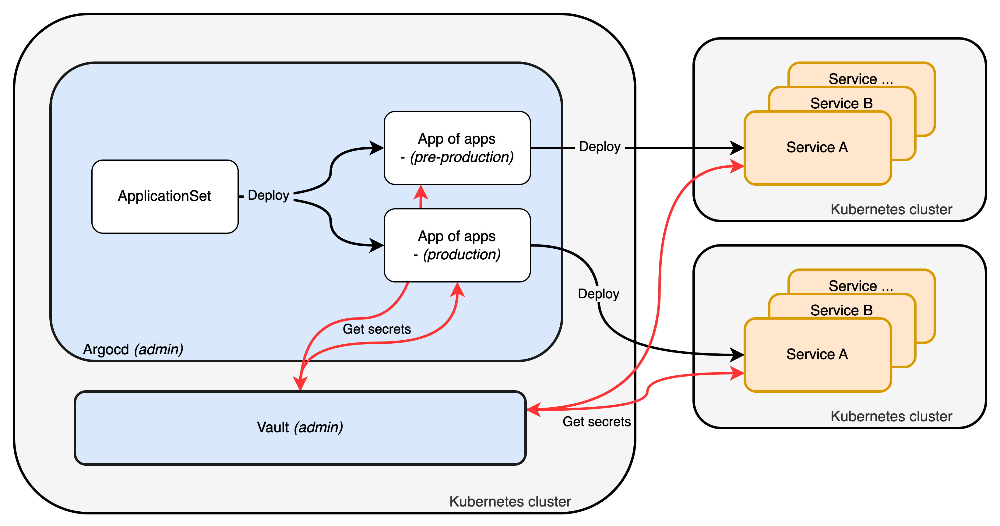

# Installation

The whole installation is performed with [ansible](https://www.ansible.com/) so it is required to install it on the computer that will run playbooks. Also, ssh access to all hosts need to be setup.

## Prerequisites

Following tools needs to be installed on the computer running the playbook :
- [ansible](https://ansible.com) *- infrastructure as code software tools.*
- [age](https://github.com/FiloSottile/age) *- simple, modern and secure encryption tool.*
- [htpasswd](https://httpd.apache.org/docs/2.4/en/programs/htpasswd.html) *- user files for basic authentication managerment.*
- [jq](https://jqlang.github.io/jq/) *- lightweight and flexible command-line JSON processor.*
- [mc](https://min.io/docs/minio/linux/reference/minio-mc.html) *- command-line tool that allows you to manage your s3.*
- [openssl](https://www.openssl.org/) *- cryptography and SSL/TLS toolkit.*
- [hvac](https://hvac.readthedocs.io/en/stable/overview.html) *- HashiCorp Vault API client for Python 3.x.*
- [sshpass](https://sourceforge.net/projects/sshpass) *- non-interactive ssh password auth.*
- [sops](https://github.com/getsops/sops) *- Simple and flexible tool for managing secrets.*
- [yq](https://github.com/mikefarah/yq) *- portable command-line YAML, JSON, XML, CSV, TOML and properties processor.*

```sh
# Clone the repository
git clone --depth 1 https://github.com/this-is-tobi/homelab.git && cd ./homelab && rm -rf ./.git

# Copy inventories examples to inventories
cp -R ./ansible/infra/inventory-example ./ansible/infra/inventory
cp -R ./ansible/kube/inventory-example ./ansible/kube/inventory
```

> __*Notes*__:
>
> *PiHole and Wireguard installation can be ignored by setting `enabled: false` in [gateway group_vars](../ansible/infra/inventory-example/group_vars/gateway.yml).*
>
> *Every kubernetes services can be disabled by commenting its declaration in the Argocd [applicationset](../argo-cd/envs/production/applicationset.yaml). Ansible will determine which service is enabled and create the appropriate secrets in vault, it will also update the dashy configmap and may ask to push the updated file for gitops needs.*


## Settings

Update the [hosts file](../ansible/infra/inventory-example/hosts.yml) and [group_vars files](../ansible/infra/inventory-example/group_vars/) to provide the appropriate infra and services settings.

Actions Runner Controller uses [Sops](https://github.com/getsops/sops) encrypted secret to store information about Github applications. These secrets are managed (encrypted/decrypted) using the wrapper script [run.sh](../run.sh) following the keys provided in [.sops.yaml](../.sops.yaml).

> *__Notes:__*
>
> *__Update Sops keys with your own__ but __leave the first age key blank__ as it is used by the cluster's automated key management system.*
>
> *Decrypt secrets by running `./run.sh -d` and encrypt secrets by running `./run.sh -e`, do not forget to recrypt secrets when changes are made.*


To create user access to the bastion, it is required to provide their informations in the `groups_vars/bastion.yml` file :
- Set `setup: true` to setup the working environment for the given user.
- Put user ssh public key in the inventory file, this will grant user access to the bastion by adding `authorized_keys`.

> __*Notes*__:
>
> *During setup, every password, token and so on are randomly generated and stored into kubernetes secrets / vault secrets.*

## Deploy

Two playbooks are available, one for [infrastructure](../ansible/infra/install.yml) installation and another one for [services](../ansible/kube/install.yml) installation.
Various tags are available in the playbooks (*for more details, take a look at the files*), it allows to launch only some part of the installation, the main ones are :

__Infra :__
```sh
# Deploy bastion
./run.sh -p ./ansible/infra/install.yml -t bastion

# Deploy gateway
./run.sh -p ./ansible/infra/install.yml -t gateway

# Deploy cluster
./run.sh -p ./ansible/infra/install.yml -t k3s
```

__Services :__

```sh
# Deploy kubernetes services
./run.sh -p ./ansible/kube/install.yml

# Deploy only core services
./run.sh -p ./ansible/kube/install.yml -t core

# Deploy only platform services
./run.sh -p ./ansible/kube/install.yml -t additional

# Deploy only keycloak
./run.sh -p ./ansible/kube/install.yml -t keycloak
```

> __*Notes*__:
>
> *By default tag `all` is used so every roles are played on playbooks launch.*
> *Multiple tags can be passed as follows :* `./run.sh -p ./ansible/infra/install.yml -t gateway,k3s`
>
> *First gateway init can take a long time to run because of openvpn key genereration (5-10min).*

## Destroy

It is possible to cleanly detroy the k3s cluster by running :

```sh
# Destroy cluster
./run.sh -p ./ansible/infra/install.yml -t k3s-destroy
```

## Kubernetes services

Kubernetes services are deployed within 2 steps, the first one deploy core services that are needed to deploy one or more platforms, core services are composed of :
- __Longhorn__ *- storage management in the cluster.*
- __Traefik__ *- ingress controler to expose services.*
- __Cert Manager__ *- certificate management for tls.*
- __Vault__ *- secret management for services deployments.*
- __Argocd__ *- deployment management for services deployments.*

Other services follow the gitops workflow, they are configured through files stored in a Git repository that is watched by Argocd.
An `applicationSet` is responsible to deploy an `app of apps` for each environement (or platform) wanted to be spin up, then the app of apps will deploy all others services with their dependencies by reading secrets into Hashicorp Vault.


The next step would be to deploy each platform environment to a dedicated cluster as described in the following schema.



## Known issues

At the moment, `mattermost` and `outline` images are not `arm64` compatible so their deployment are using custom mirror image with compatibility (see. [this repo](https://github.com/this-is-tobi/multiarch-mirror) and and associated Argocd applications).

The [official Harbor helm chart](https://artifacthub.io/packages/helm/harbor/harbor) cannot be used due to arm64 incompatibility, the [Bitnami distribution](https://artifacthub.io/packages/helm/bitnami/harbor) is used instead.
