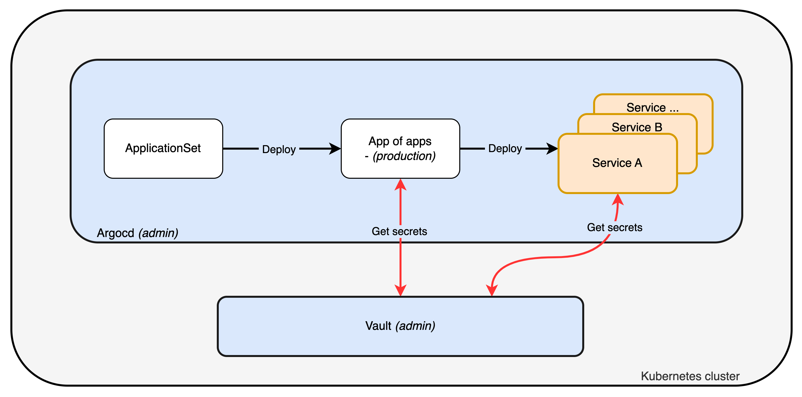

# Installation

The installation is performed in two phases:
1. **Infrastructure** deployment with [Ansible](https://www.ansible.com/) for gateway and K3s cluster setup
2. **Applications** deployment with [ArgoCD](https://argo-cd.readthedocs.io/) following a GitOps approach

## Prerequisites

Following tools need to be installed on the computer running the deployment:
- [ansible](https://ansible.com) *- infrastructure as code software tools.*
- [age](https://github.com/FiloSottile/age) *- simple, modern and secure encryption tool.*
- [helm](https://helm.sh/) *- Kubernetes package manager.*
- [kubectl](https://kubernetes.io/docs/reference/kubectl/) *- Kubernetes command-line tool.*
- [sops](https://github.com/getsops/sops) *- simple and flexible tool for managing secrets.*
- [sshpass](https://sourceforge.net/projects/sshpass) *- non-interactive ssh password auth.*
- [yq](https://github.com/mikefarah/yq) *- portable command-line YAML, JSON, XML, CSV, TOML and properties processor.*

```sh
# Clone the repository
git clone --depth 1 https://github.com/this-is-tobi/homelab.git && cd ./homelab && rm -rf ./.git

# Copy inventory example to inventory
cp -R ./ansible/inventory-example ./ansible/inventory
```

> __*Notes*__:
>
> *PiHole and Wireguard installation can be ignored by setting `enabled: false` in [gateway group_vars](../ansible/inventory-example/group_vars/gateway.yml).*


## Settings

### Infrastructure

Update the [hosts file](../ansible/inventory-example/hosts.yml) and [group_vars files](../ansible/inventory-example/group_vars/) to provide the appropriate infrastructure settings.

To create admin access to the machines, it is required to provide their informations in the `group_vars/all.yml` file:
- Put user ssh public key in the inventory file, this will grant admin access to the infrastructure by adding `authorized_keys`.

### Applications (GitOps)

Applications are managed via ArgoCD ApplicationSets. Configuration is done through:

1. **Instance configuration** - Enable/disable apps in JSON files:
   - Core services: [./argo-cd/core/instances/homelab/production.json](../argo-cd/core/instances/homelab/production.json)
   - Platform services: [./argo-cd/platforms/instances/homelab/production.json](../argo-cd/platforms/instances/homelab/production.json)

2. **Values configuration** - Customize app values in YAML files:
   - Core values: [./argo-cd/core/values/homelab/](../argo-cd/core/values/homelab/)
   - Platform values: [./argo-cd/platforms/values/homelab/](../argo-cd/platforms/values/homelab/)

### Secrets Management

[Sops](https://github.com/getsops/sops) is used to encrypt sensitive values. These secrets are managed (encrypted/decrypted) using the wrapper script [run.sh](../run.sh) following the keys provided in [.sops.yaml](../.sops.yaml).

> *__Notes:__*
>
> *__Update Sops keys with your own__ but __leave the first age key blank__ as it is used by the cluster's automated key management system.*
>
> *Decrypt secrets by running `./run.sh -d` and encrypt secrets by running `./run.sh -e`, do not forget to re-encrypt secrets when changes are made.*

> __*Notes*__:
>
> *During setup, every password, token and so on are randomly generated and stored into Vault secrets.*


## Deploy

### Infrastructure

Deploy gateway and K3s cluster using the Ansible playbook:

```sh
# Update Ansible collections and deploy infrastructure
./run.sh -p ./ansible/install.yml -u -k

# Or with specific tags
./run.sh -p ./ansible/install.yml -t gateway   # Deploy gateway only
./run.sh -p ./ansible/install.yml -t k3s       # Deploy K3s cluster only
```

The `-k` flag fetches the kubeconfig from the master node and merges it into your local kubeconfig.

### Applications (GitOps)

Once the infrastructure is ready, bootstrap ArgoCD and deploy services:

```sh
# Set kubectl context
kubectl config use-context homelab

# Bootstrap ArgoCD
./run.sh -b

# Apply core services (Longhorn, Vault, Cert-Manager, etc.)
./run.sh -c homelab

# Apply platform services (Keycloak, Gitea, Harbor, etc.)
./run.sh -s homelab
```

> __*Notes*__:
>
> *Multiple tags can be passed as follows:* `./run.sh -p ./ansible/install.yml -t gateway,k3s`
>
> *First gateway init can take a long time to run because of OpenVPN key generation (5-10min).*


## Destroy

It is possible to cleanly destroy the K3s cluster by running:

```sh
# Destroy cluster
./run.sh -p ./ansible/install.yml -t k3s-destroy
```


## Architecture

### Core Services

Core services provide the foundation for the platform:
- **Longhorn** *- storage management in the cluster.*
- **Ingress-NGINX** *- ingress controller to expose services.*
- **Cert-Manager** *- certificate management for TLS.*
- **Vault Operator** *- secret management for services deployments.*
- **ArgoCD** *- deployment management following GitOps.*
- **CloudNative-PG** *- PostgreSQL operator for databases.*

### Platform Services

Platform services are deployed on top of core services:
- **Keycloak** *- identity and access management (SSO).*
- **Gitea** *- self-hosted Git service.*
- **Harbor** *- container registry.*
- **Mattermost** *- team communication.*
- **And more...*

### GitOps Workflow

Services follow the GitOps workflow with ArgoCD ApplicationSets:

1. **ApplicationSet** reads instance configuration from JSON files
2. **Application** is created for each enabled service
3. **Helm chart** is deployed with values from the values directory
4. **Vault** provides secrets via Vault Secrets Operator (VSO)



The next step would be to deploy each platform environment to a dedicated cluster as described in the following schema.


## Known issues

At the moment, `mattermost` and `outline` images are not `arm64` compatible so their deployment are using custom mirror image with compatibility (see. [this repo](https://github.com/this-is-tobi/multiarch-mirror) and associated ArgoCD applications).

The [official Harbor helm chart](https://artifacthub.io/packages/helm/harbor/harbor) cannot be used due to arm64 incompatibility, the [Bitnami distribution](https://artifacthub.io/packages/helm/bitnami/harbor) is used instead.
