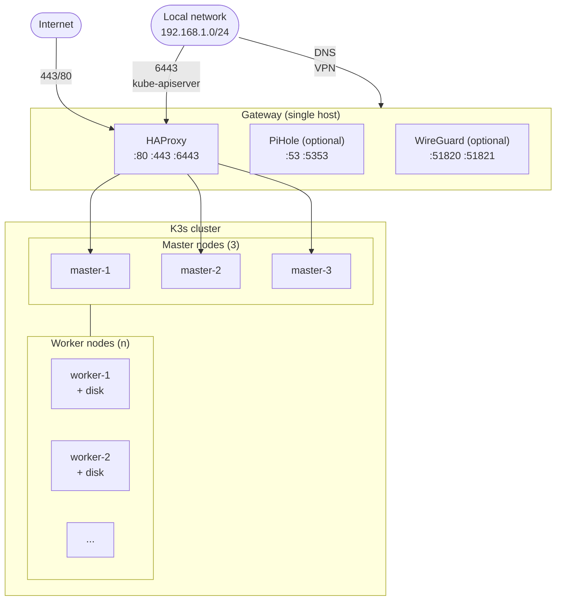

# Infrastructure

## Overview

```mermaid
flowchart TB
    internet([Internet])
    lan([Local network<br/>192.168.1.0/24])

    subgraph gw["Gateway (single host)"]
        haproxy["HAProxy<br/>:80 :443 :6443"]
        pihole["PiHole (optional)<br/>:53 :5353"]
        wg["WireGuard (optional)<br/>:51820 :51821"]
    end

    subgraph cluster["K3s cluster"]
        subgraph masters["Master nodes (3)"]
            m1[master-1]
            m2[master-2]
            m3[master-3]
        end
        subgraph workers["Worker nodes (n)"]
            w1[worker-1<br/>+ disk]
            w2[worker-2<br/>+ disk]
            wN[...]
        end
    end

    internet -->|443/80| haproxy
    lan -->|6443<br/>kube-apiserver| haproxy
    lan -->|DNS<br/>VPN| gw
    haproxy --> m1
    haproxy --> m2
    haproxy --> m3
    masters --- workers
```

## Gateway

A single host is configured as the gateway to the local network (handles all incoming traffic). It runs the following systemd-managed services:

- [HAProxy](https://www.haproxy.org/) — load-balances incoming external HTTP/HTTPS (ports 80 & 443) onto the K3s ingress controller, and the K3s api-server traffic (port 6443) onto the master nodes.
- [PiHole](https://pi-hole.net/) *(optional)* — network-level DNS sinkhole for ad / tracker filtering.
- [WireGuard](https://www.wireguard.com/) *(optional)* — VPN access to the local network from the internet. Clients are managed via the web UI.

## K3s cluster

The cluster runs [k3s](https://k3s.io) (lightweight Kubernetes) with the following roles:

- **3 master nodes** — control plane, fronted by HAProxy on port 6443 for HA.
- **n worker nodes** — application workloads. Workers tagged `additional_disk: true` in [inventory/hosts.yml](../ansible/inventory-example/hosts.yml) are enrolled into Longhorn for distributed block storage.

The integrated [klipper-lb](https://github.com/k3s-io/klipper-lb) load balancer is used; the bundled Traefik ingress controller is disabled and replaced manually by ingress-nginx (deployed via GitOps).

[system-upgrade-controller](https://github.com/rancher/system-upgrade-controller) is deployed cluster-wide to perform automatic K3s upgrades through two plans (one for masters, one for workers).

[Longhorn](https://longhorn.io/) provides distributed block storage on top of the disks of the worker nodes flagged `additional_disk: true`.
