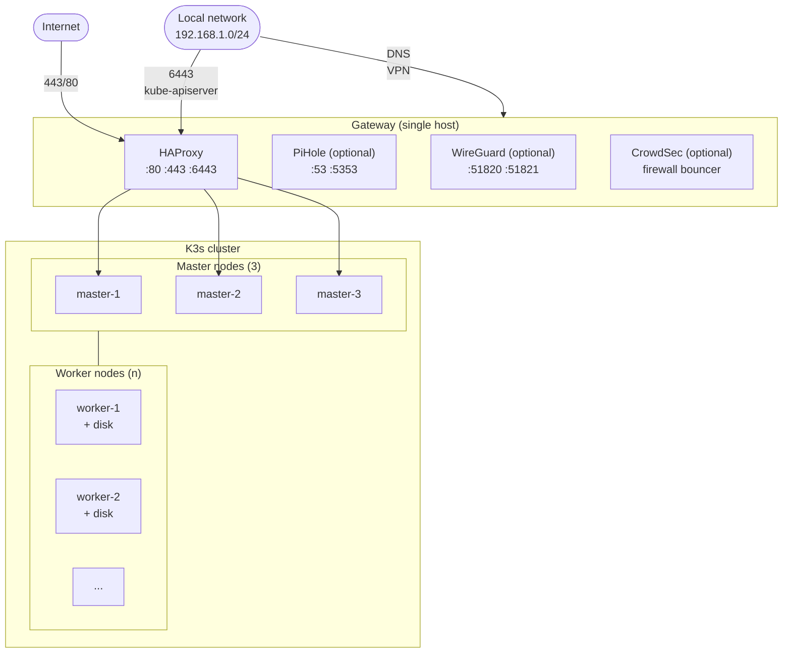

# Infrastructure

## Overview

```mermaid
flowchart TB
    internet([Internet])
    lan([Local network<br/>192.168.1.0/24])

    subgraph gw["Gateway (single host)"]
        haproxy["HAProxy<br/>:80 :443 :6443"]
        pihole["PiHole (optional)<br/>:53 :5353"]
        wg["WireGuard (optional)<br/>:51820 :51821"]
        crowdsec["CrowdSec (optional)<br/>firewall bouncer"]
    end

    subgraph cluster["K3s cluster"]
        subgraph masters["Master nodes (3)"]
            m1[master-1]
            m2[master-2]
            m3[master-3]
        end
        subgraph workers["Worker nodes (n)"]
            w1[worker-1<br/>+ disk]
            w2[worker-2<br/>+ disk]
            wN[...]
        end
    end

    internet -->|443/80| haproxy
    lan -->|6443<br/>kube-apiserver| haproxy
    lan -->|DNS<br/>VPN| gw
    haproxy --> m1
    haproxy --> m2
    haproxy --> m3
    masters --- workers
```

## Gateway

A single host is configured as the gateway to the local network (handles all incoming traffic). It runs the following Docker Compose–managed services:

- [HAProxy](https://www.haproxy.org/) — load-balances incoming external HTTP/HTTPS (ports 80 & 443) onto the K3s ingress controller, and the K3s api-server traffic (port 6443) onto the master nodes.
- [PiHole](https://pi-hole.net/) *(optional)* — network-level DNS sinkhole for ad / tracker filtering.
- [WireGuard](https://www.wireguard.com/) *(optional)* — VPN access to the local network from the internet. Clients are managed via the web UI.
- [CrowdSec](https://www.crowdsec.net/) *(optional)* — open-source security engine that analyses logs (HAProxy, sshd, syslog) and blocks malicious IPs via an nftables firewall bouncer. Enrolled in the CrowdSec console for community threat intelligence.

Auto-generated secrets (PiHole password, WireGuard password) are written back as dot-files under `inventory/group_vars/` and should be added to `vault.yml` after the first run.

## K3s cluster

The cluster runs [k3s](https://k3s.io) (lightweight Kubernetes) with the following roles:

- **3 master nodes** — control plane, fronted by HAProxy on port 6443 for HA.
- **n worker nodes** — application workloads. Workers tagged `additional_disk: true` in [inventory/hosts.yml](../ansible/inventory-example/hosts.yml) are enrolled into Longhorn for distributed block storage.

The K3s-bundled Traefik is disabled at install time and a GitOps-managed [Traefik v3](https://doc.traefik.io/traefik/) is deployed instead as the ingress controller and Gateway API implementation.

### Networking choices

Two decisions are made at install time in `inventory/group_vars/k3s.yml`, and both combinations are supported:

| Variable       | Options              | Default   | Notes                                                                                                                                                                                                                                                                                   |
| -------------- | -------------------- | --------- | --------------------------------------------------------------------------------------------------------------------------------------------------------------------------------------------------------------------------------------------------------------------------------------- |
| `k3sCni`       | `flannel` / `cilium` | `flannel` | `flannel` is K3s's bundled CNI (pod CIDR `10.42.0.0/16`). `cilium` adds eBPF, richer NetworkPolicy and Hubble, and additionally requires the `cilium` app enabled in your instance's `core.yaml`.                                                                                       |
| `k3sServiceLb` | `true` / `false`     | `true`    | `true` runs K3s's built-in ServiceLB ([klipper-lb](https://github.com/k3s-io/klipper-lb)), which binds each LoadBalancer Service's ports as host ports on every node. `false` means no LB controller — expose ingress via a static `spec.externalIPs` list, MetalLB, or Cilium LB-IPAM. |

Neither choice is one-way, and both are covered on a fresh install:

- **Starting on Cilium** — setting `k3sCni: cilium` makes the `k3s/cni` role apply Cilium immediately after the first master is up, before workers join and before the GitOps bootstrap. That ordering is mandatory rather than cosmetic: with no CNI every node stays `NotReady` and ordinary pods cannot schedule — ArgoCD's included — so the GitOps bootstrap can never be what installs the CNI. Cilium breaks the cycle because its agent and operator run on the host network and tolerate `NotReady` nodes. ArgoCD adopts the objects on its first sync; the role skips itself once a CNI is present. Set `k3sCniChartValues` to your instance's cilium values so the bootstrap render matches what ArgoCD reconciles afterwards.
- **Starting on flannel, moving later** — the shortest path to a working cluster. `scripts/cilium-migrate-node.sh` then moves a *running* cluster onto Cilium one node at a time, with per-node rollback (`scripts/cilium-rollback-node.sh`) while the window is open. This is what this repo's own cluster did.

See the comments in [inventory-example/group_vars/k3s.yml](../ansible/inventory-example/group_vars/k3s.yml) for the full trade-offs and the ordering constraints (`--flannel-backend` is a K3s *critical* flag — all servers must agree).

This repo's own cluster runs `cilium` with ServiceLB disabled, exposing Traefik through a static `externalIPs` list; the gateway HAProxy forwards public 80/443 onto the node IPs.

[system-upgrade-controller](https://github.com/rancher/system-upgrade-controller) is deployed cluster-wide to perform automatic K3s upgrades through two plans (one for masters, one for workers).

[Longhorn](https://longhorn.io/) provides distributed block storage on top of the disks of the worker nodes flagged `additional_disk: true`.

## Ansible roles

All Ansible roles live under `ansible/roles/` and follow a consistent structure (`tasks/`, `defaults/`, `meta/`, `templates/`, `handlers/`).

| Scope   | Role             | Description                                                              |
| ------- | ---------------- | ------------------------------------------------------------------------ |
| common  | `hostname`       | Set hostname and update `/etc/hosts`.                                    |
| common  | `locales`        | Configure system locales.                                                |
| common  | `ssh`            | Harden SSH via drop-in config, deploy authorized keys.                   |
| common  | `hardening`      | Disable unnecessary services, kernel sysctl hardening, `/etc/hosts`.     |
| common  | `docker`         | Install Docker CE from the official apt repository.                      |
| common  | `upgrade`        | Dist-upgrade all packages, reboot if required.                           |
| gateway | `haproxy`        | Deploy HAProxy via Docker Compose.                                       |
| gateway | `pihole`         | Deploy PiHole via Docker Compose (optional).                             |
| gateway | `wireguard`      | Deploy WireGuard-Easy via Docker Compose (optional).                     |
| gateway | `crowdsec`       | Deploy CrowdSec engine + firewall bouncer (optional).                    |
| k3s     | `prereq`         | K3s prerequisites — IP forwarding, cgroups, utility packages.            |
| k3s     | `download`       | Download the K3s binary matching the target architecture.                |
| k3s     | `storage`        | Install iSCSI/NFS packages and mount additional storage disks.           |
| k3s     | `cni`            | Bootstrap Cilium when K3s is installed without a CNI (`k3sCni: cilium`). |
| k3s     | `deploy/masters` | Deploy K3s server (master) nodes with HA cluster-init.                   |
| k3s     | `deploy/workers` | Deploy K3s agent (worker) nodes.                                         |
| k3s     | `destroy`        | Cleanly destroy a K3s installation and restore system state.             |
| k3s     | `registry`       | Configure private container registry (Harbor) on K3s nodes.              |
| k3s     | `users`          | Create Kubernetes users with x509 certificates and RBAC.                 |
