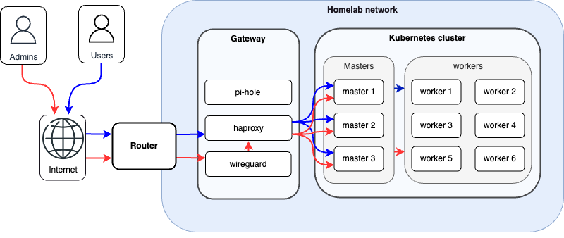

# Infrastructure

## Gateway

A host is configured as the gateway to the local network (*i.e handle all incoming traffic*). It runs various services deployed with systemd :

- [Haproxy](https://www.haproxy.org/) for loadbalancing all incoming external requests (*ports 80 & 443*) to the k3s cluster and loadbalancing k3s api server (*port 6443*).
- [PiHole](https://pi-hole.net/) *(optional)* for advertisements filtering.
- [Wireguard](https://www.wireguard.com/) *(optional)* for external access to the local network (*i.e from internet*). VPN clients could be add using the web interface (see. services section).

## K3S cluster

Some hosts are configrured to run [k3s](https://k3s.io) (*Lightweight Kubernetes*) with the following roles :
- 3 x master nodes
- 5 x worker nodes

The cluster comes with k3s integrated [klipper](https://github.com/k3s-io/klipper-lb) loadbalancer ([traefik](https://traefik.io/) ingressController is disabled and installed manually).
For convenience, [system-upgrade-controller](https://github.com/rancher/system-upgrade-controller) is deployed to perform an automatic k3s upgrade on each node by using two plans (one for masters and the other one for workers).

[Longhorn](https://longhorn.io/) is used to deliver distributed block storage accross kubernetes, it will enroll all servers tagged `additional_disk: true` in [inventory/hosts.yml](../ansible/infra/inventory-example/hosts.yml).
