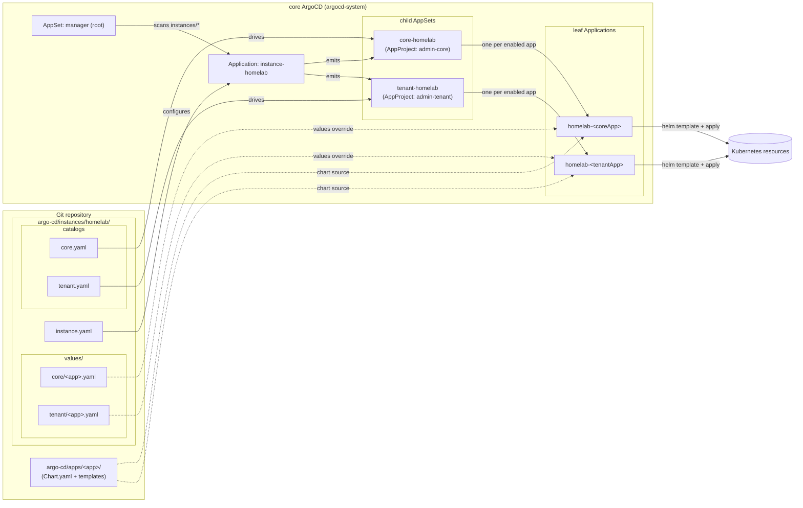
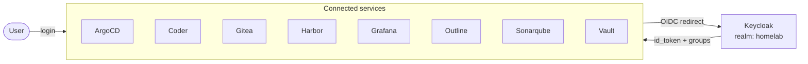
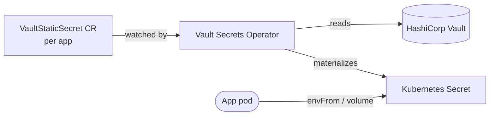

# Services

## Gateway

### Haproxy

[HAProxy](https://www.haproxy.org/) is a free and open source software that provides a high availability load balancer and reverse proxy for TCP and HTTP-based applications that spreads requests across multiple servers.

Haproxy load-balances all incoming http and https traffic from the Internet (ports 80 and 443) via the master nodes, and also load-balances all Kubernetes api server traffic on the local network (port 6443). An ACL rule is defined to accept only local network IP address requests for the api server.

The web interface lets you view the health status of master nodes on both types of endpoints (server api and internet traffic).

### Pi-Hole

[Pi-hole](https://pi-hole.net/) is a Linux network-level advertisement and Internet tracker blocking application which acts as a DNS sinkhole and optionally a DHCP server, intended for use on a private network. It is designed for low-power embedded devices with network capability, such as the Raspberry Pi, but can be installed on almost any Linux machine.

Pi-hole has the ability to block traditional website advertisements as well as advertisements in unconventional places, such as smart TVs and mobile operating system advertisements.

Using the web interface, you can enable/disable ad and tracker blocking, add a list of domains to be blocked, and configure local network DNS settings (and DHCP if required). It is also possible to view statistics on blocked domains according to the privacy rules set.

### Wireguard

[WireGuard](https://www.wireguard.com/) is a communication protocol and free and open-source software that implements encrypted virtual private networks (VPNs), and was designed with the goals of ease of use, high speed performance, and low attack surface.

Wireguard's web interface lets you create / delete / activate / deactivate VPN users, download their configuration file and display the user's QrCode. With this user configuration file, a user can access the homelab network to perform an ssh connection to the machines and then request the Kubernetes api server.

### CrowdSec

[CrowdSec](https://www.crowdsec.net/) is an open-source security engine that analyses logs from various sources (HAProxy, sshd, syslog) and detects malicious behaviour using community-curated scenarios. Detected attackers are blocked at the network level via an nftables firewall bouncer.

The gateway deployment runs the CrowdSec engine as a Docker container with the following collections:
- `crowdsecurity/linux` — SSH brute force, bad user agents, port scans
- `crowdsecurity/sshd` — SSH-specific attack patterns
- `crowdsecurity/haproxy` — HTTP abuse through the load balancer
- `crowdsecurity/base-http-scenarios` — generic HTTP attacks (scanners, exploits)
- `crowdsecurity/http-cve` — known CVE exploit patterns

A separate Kubernetes deployment (CrowdSec Helm chart) provides cluster-wide monitoring via a DaemonSet agent that parses container logs from ingress-nginx.

### Access

Gateway web interface services are deployed and accessible for admin purpose, they are available on local network at :

| Name                | Url                         |
| ------------------- | --------------------------- |
| Haproxy dashboard   | <http://192.168.1.99:8404>  |
| Pihole dashboard    | <http://192.168.1.99:5353>  |
| Wireguard dashboard | <http://192.168.1.99:51821> |

> *__Notes:__ Replace `192.168.1.99` with the gateway's ip address set in [hosts.yml](../ansible/inventory-example/hosts.yml).*

## Kubernetes

### Services

The following services are deployed in the cluster :

| Name                                                                              | Description                                     | Helm chart                                                                                                                                      |
| --------------------------------------------------------------------------------- | ----------------------------------------------- | ----------------------------------------------------------------------------------------------------------------------------------------------- |
| [Actions-runner-controller](https://github.com/actions/actions-runner-controller) | Github Actions runners controller               | [actions-runner-controller/actions-runner-controller](https://artifacthub.io/packages/helm/actions-runner-controller/actions-runner-controller) |
| [ArgoCD](https://argo-cd.readthedocs.io/en/stable/)                               | GitOps continuous delivery tool                 | [argo/argo-cd](https://artifacthub.io/packages/helm/argo/argo-cd)                                                                               |
| [Argo-workflows](https://argoproj.github.io/workflows/)                           | Workflow automation engine                      | [argo/argo-workflows](https://artifacthub.io/packages/helm/argo/argo-workflows)                                                                 |
| [Cert-manager](https://cert-manager.io/)                                          | Cloud native certificate management             | [cert-manager/cert-manager](https://artifacthub.io/packages/helm/cert-manager/cert-manager)                                                     |
| [Cloud-native-postgres](https://cloudnative-pg.io/)                               | Cloud native postgres database management       | [cnpg/cloudnative-pg](https://artifacthub.io/packages/helm/cloudnative-pg/cloudnative-pg)                                                       |
| [Coder](https://coder.com/)                                                       | Remote selfhosted development environments      | [coder-v2/coder](https://artifacthub.io/packages/helm/coder-v2/coder)                                                                           |
| [CrowdSec](https://www.crowdsec.net/)                                             | Open-source security engine & threat detection  | [crowdsec/crowdsec](https://artifacthub.io/packages/helm/crowdsec/crowdsec)                                                                     |
| [Homepage](https://gethomepage.dev/)                                              | Home dashboard                                  | [unknowniq/homepage](https://artifacthub.io/packages/helm/unknowniq/homepage)                                                                   |
| [Gitea](https://about.gitea.com/)                                                 | Private, Fast, Reliable DevOps Platform         | [gitea/gitea](https://artifacthub.io/packages/helm/gitea/gitea)                                                                                 |
| [Harbor](https://goharbor.io/)                                                    | Cloud native registry                           | [bitnami/harbor](https://artifacthub.io/packages/helm/bitnami/harbor)                                                                           |
| [Ingress-nginx](https://kubernetes.github.io/ingress-nginx/)                      | Kubernetes ingress controller                   | [ingress-nginx/ingress-nginx](https://artifacthub.io/packages/helm/ingress-nginx/ingress-nginx)                                                 |
| [Keycloak](https://keycloak.org)                                                  | Single Sign On service                          | [bitnami/keycloak](https://artifacthub.io/packages/helm/bitnami/keycloak)                                                                       |
| [Kubernetes-dashboard](https://github.com/kubernetes/dashboard)                   | Kubernetes dashboard                            | [k8s-dashboard/kubernetes-dashboard](https://artifacthub.io/packages/helm/k8s-dashboard/kubernetes-dashboard)                                   |
| [Longhorn](https://longhorn.io/)                                                  | Cloud native distributed block storage          | [longhorn/longhorn](https://artifacthub.io/packages/helm/longhorn/longhorn)                                                                     |
| [Mattermost](https://mattermost.com/)                                             | Chat service with file sharing and integrations | [mattermost/mattermost-team-edition](https://artifacthub.io/packages/helm/mattermost/mattermost-team-edition)                                   |
| [MLflow](https://mlflow.org/)                                                     | ML experiment tracking and model registry       | [community-charts/mlflow](https://artifacthub.io/packages/helm/community-charts/mlflow)                                                         |
| [Outline](https://www.getoutline.com/)                                            | Share notes and wiki with your team             | [lrstanley/outline](https://artifacthub.io/packages/helm/lrstanley/outline)                                                                     |
| [Prometheus-stack](https://prometheus.io/)                                        | Open-source monitoring solution                 | [prometheus-community/kube-prometheus-stack](https://artifacthub.io/packages/helm/prometheus-community/kube-prometheus-stack)                   |
| [RustFS](https://rustfs.com/)                                                     | High Performance Object Storage                 | -                                                                                                                                               |
| [Sonarqube](https://www.sonarsource.com/products/sonarqube/)                      | Code quality analysis service                   | [sonarqube/sonarqube](https://artifacthub.io/packages/helm/sonarqube/sonarqube)                                                                 |
| [Sops](https://github.com/isindir/sops-secrets-operator)                          | Secret manager that decode on the fly           | [sops-secrets-operator/sops-secrets-operator](https://artifacthub.io/packages/helm/sops-secrets-operator/sops-secrets-operator)                 |
| [System-upgrade-controller](https://github.com/rancher/system-upgrade-controller) | K3S upgrade controller                          | -                                                                                                                                               |
| [Teleport](https://goteleport.com/)                                               | Secure access and identity for infrastructure   | [teleport/teleport-cluster](https://artifacthub.io/packages/helm/teleport/teleport-cluster)                                                     |
| [Trivy-operator](https://aquasecurity.github.io/trivy-operator/latest/)           | Kubernetes-native security toolkit              | [aqua/trivy-operator](https://aquasecurity.github.io/helm-charts/)                                                                              |
| [Vault](https://www.vaultproject.io/)                                             | Secret management service                       | [hashicorp/vault](https://artifacthub.io/packages/helm/hashicorp/vault)                                                                         |
| [Vault-operator](https://developer.hashicorp.com/vault/docs/platform/k8s/vso)     | Vault Secrets Operator for Kubernetes           | [hashicorp/vault-secrets-operator](https://artifacthub.io/packages/helm/hashicorp/vault-secrets-operator)                                       |
| [Vaultwarden](https://github.com/dani-garcia/vaultwarden)                         | Password management service                     | [vaultwarden/vaultwarden](https://artifacthub.io/packages/helm/vaultwarden/vaultwarden)                                                         |

### Versions

All services helm charts and versions are managed through ArgoCD ApplicationSets with configuration stored in:
- **App charts**: [./argo-cd/apps/](../argo-cd/apps/) — each app has its own `Chart.yaml` defining the chart version and dependencies.
- **Per-instance metadata**: [./argo-cd/instances/\<instance\>/instance.yaml](../argo-cd/instances/homelab/instance.yaml) — cluster destination, env, repos, AppProject bindings.
- **Per-instance app catalog**: [./argo-cd/instances/\<instance\>/core.yaml](../argo-cd/instances/homelab/core.yaml) and [tenant.yaml](../argo-cd/instances/homelab/tenant.yaml) — enable/disable apps + per-app overrides (sync wave, namespace, release name, ...).
- **Per-instance values**: [./argo-cd/instances/\<instance\>/values/core/\<app\>.yaml](../argo-cd/instances/homelab/values/core/) and [tenant/\<app\>.yaml](../argo-cd/instances/homelab/values/tenant/) — values overrides applied on top of the chart defaults.

### Management

Services are managed by a **two-level** ApplicationSet hierarchy declared by the `homelab-core` chart in the `argocd-system` namespace:

- The root `manager` AppSet discovers each instance folder and emits one Application per instance pointing at the `instance-manager` chart.
- That chart renders two child AppSets per instance — `core-<instance>` (platform tier, bound to `admin-core` AppProject) and `tenant-<instance>` (apps tier, bound to `admin-tenant` AppProject).

To enable or disable a service, edit the relevant entry in [argo-cd/instances/homelab/core.yaml](../argo-cd/instances/homelab/core.yaml) or [tenant.yaml](../argo-cd/instances/homelab/tenant.yaml) and flip `enabled: "true"` / `enabled: "false"`.

### Access

Kubernetes services that are available through user interfaces are centralized on the [Homepage](https://gethomepage.dev/) dashboard, the full list is :

#### Admin

| Name               | Url                                |
| ------------------ | ---------------------------------- |
| ArgoCD *(admin)*   | <https://gitops.admin.domain.com>  |
| Longhorn *(admin)* | <http://longhorn.admin.domain.com> |
| Vault *(admin)*    | <https://vault.admin.domain.com>   |

#### Standard

| Name                 | Url                              |
| -------------------- | -------------------------------- |
| ArgoCD               | <https://gitops.domain.com>      |
| Coder                | <https://coder.domain.com>       |
| Homepage             | <https://domain.com>             |
| Gitea                | <https://git.domain.com>         |
| Grafana              | <https://monitoring.domain.com>  |
| Harbor               | <https://registry.domain.com>    |
| Keycloak             | <https://sso.domain.com>         |
| Kubernetes-dashboard | <https://kube.domain.com>        |
| Mattermost           | <https://mattermost.domain.com>  |
| RustFS *- api*       | <https://s3.domain.com>          |
| RustFS *- console*   | <https://console.s3.domain.com>  |
| Outline              | <https://outline.domain.com>     |
| SonarQube            | <http://sonarqube.domain.com>    |
| Vault                | <https://vault.domain.com>       |
| Vaultwarden          | <https://vaultwarden.domain.com> |

> *__Notes:__ Replace `domain.com` by your own domain configured in your values files.*

### Single sign on

[Keycloak](https://keycloak.org/) is deployed as the cluster single sign-on tool. It provides a single account (username / password pair) that grants access to multiple services, and propagates user groups to control access levels.

Users and access levels are managed via the Keycloak interface (cf. [keycloak service url](#kubernetes)) using the admin credentials from Vault (`keycloak.username` / `keycloak.password` under the `keycloak` secret path).

> Don't forget to select the `homelab` realm.

A default `admin` group grants admin-level access on every connected service; users not in this group get standard access.

Services currently connected through SSO:
- ArgoCD
- Coder
- Harbor
- Gitea
- Grafana
- Outline
- Sonarqube
- Vault

> *RustFS does not support OIDC — admin credentials are managed via Vault and rotated through the Vault Secrets Operator.*

### Secrets

Secrets are sourced from Vault and synced into Kubernetes by the [Vault Secrets Operator](https://developer.hashicorp.com/vault/docs/platform/k8s/vso) (VSO). Each chart that needs secrets depends on the `vso-utils` subchart, which renders `VaultStaticSecret` custom resources pointing at a Vault path.

### Monitoring

The cluster itself and some services are monitored using [Prometheus](https://prometheus.io/) and [Grafana](https://grafana.com/), `ServiceMonitor` are enabled for Vault, Argocd and Trivy-operator to increase metrics coming from these applications.

Some dashboards are already delivered with the installation but more can be added in [argo-cd/apps/prometheus-stack/grafana-dashboards/](../argo-cd/apps/prometheus-stack/grafana-dashboards/), they will be automatically loaded on ArgoCD synchronization via the [dashboards.yaml](../argo-cd/apps/prometheus-stack/templates/dashboards.yaml) template. Already added dashboards are:

| Dashboard file                                                                                 | Grafana dashboard ID                                                                                          |
| ---------------------------------------------------------------------------------------------- | ------------------------------------------------------------------------------------------------------------- |
| [argo-cd.json](../argo-cd/apps/prometheus-stack/grafana-dashboards/argo-cd.json)               | [14584](https://grafana.com/grafana/dashboards/14584-argo-cd/)                                                |
| [cert-manager.json](../argo-cd/apps/prometheus-stack/grafana-dashboards/cert-manager.json)     | [20340](https://grafana.com/grafana/dashboards/20340-cert-manager/)                                           |
| [cloudnative-pg.json](../argo-cd/apps/prometheus-stack/grafana-dashboards/cloudnative-pg.json) | [20417](https://grafana.com/grafana/dashboards/20417-cloudnativepg/)                                          |
| [gitea.json](../argo-cd/apps/prometheus-stack/grafana-dashboards/gitea.json)                   | [17802](https://grafana.com/grafana/dashboards/17802-gitea-dashbaord/)                                        |
| [harbor.json](../argo-cd/apps/prometheus-stack/grafana-dashboards/harbor.json)                 | *- ( [source](https://github.com/goharbor/harbor/blob/main/contrib/grafana-dashboard/metrics-example.json) )* |
| [k3s.json](../argo-cd/apps/prometheus-stack/grafana-dashboards/k3s.json)                       | [15282](https://grafana.com/grafana/dashboards/15282-k8s-rke-cluster-monitoring/)                             |
| [kube-global.json](../argo-cd/apps/prometheus-stack/grafana-dashboards/kube-global.json)       | [15757](https://grafana.com/grafana/dashboards/15757-kubernetes-views-global/)                                |
| [kube-node.json](../argo-cd/apps/prometheus-stack/grafana-dashboards/kube-node.json)           | [15759](https://grafana.com/grafana/dashboards/15759-kubernetes-views-nodes/)                                 |
| [kube-ns.json](../argo-cd/apps/prometheus-stack/grafana-dashboards/kube-ns.json)               | [15758](https://grafana.com/grafana/dashboards/15758-kubernetes-views-namespaces/)                            |
| [kube-pod.json](../argo-cd/apps/prometheus-stack/grafana-dashboards/kube-pod.json)             | [15760](https://grafana.com/grafana/dashboards/15760-kubernetes-views-pods/)                                  |
| [longhorn.json](../argo-cd/apps/prometheus-stack/grafana-dashboards/longhorn.json)             | [13032](https://grafana.com/grafana/dashboards/13032-longhorn-example-v1-1-0/)                                |
| [trivy.json](../argo-cd/apps/prometheus-stack/grafana-dashboards/trivy.json)                   | [16337](https://grafana.com/grafana/dashboards/16337-trivy-operator-vulnerabilities/)                         |
| [vault.json](../argo-cd/apps/prometheus-stack/grafana-dashboards/vault.json)                   | [12904](https://grafana.com/grafana/dashboards/12904-hashicorp-vault/)                                        |
