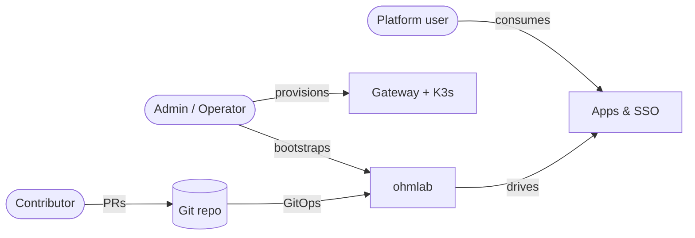

# Projects

This page describes how to interact with the homelab depending on your role.



## Admin

The admin owns the cluster lifecycle: provisioning hosts, bootstrapping ArgoCD, and curating the apps catalog.

### First install

1. Prepare the inventory in [ansible/inventory/](../ansible/inventory-example/) (hosts, SSH keys, gateway settings).
2. Deploy infrastructure and fetch kubeconfig:
   ```sh
   ./run.sh -p ./ansible/install.yml -u -k
   ```
3. Bootstrap the GitOps stack:
   ```sh
   kubectl config use-context homelab
   ARGOCD_ADMIN_PASSWORD=<choose-a-password> ./run.sh -b homelab
   ```
4. Once `keycloak` is healthy, enable OIDC for the core ArgoCD by uncommenting the `oidc.config` block in [argo-cd/instances/homelab/values/core/ohmlab.yaml](../argo-cd/instances/homelab/values/core/ohmlab.yaml).

### Enable / disable services

1. Edit [argo-cd/instances/homelab/core.yaml](../argo-cd/instances/homelab/core.yaml) (platform tier) or [tenant.yaml](../argo-cd/instances/homelab/tenant.yaml) (apps tier) and flip `enabled` on the relevant entry.
2. Commit & push. The corresponding child AppSet (`core-homelab` or `tenant-homelab`) reconciles automatically (no helm/kubectl needed).

### Tune service values

1. Edit [argo-cd/instances/homelab/values/core/\<app\>.yaml](../argo-cd/instances/homelab/values/core/) or [tenant/\<app\>.yaml](../argo-cd/instances/homelab/values/tenant/).
2. Commit & push. The corresponding `Application` syncs the new values.

### Adding a new app

1. Create a Helm chart under `argo-cd/apps/<app>/` (or a wrapper around an upstream chart).
2. Decide the tier:
   - **core** for infra / identity / observability / security / cluster-wide concerns.
   - **tenant** for user-facing apps.
   - **tier-flexible** for things that may live in either tier depending on topology
     (e.g. ingress controller, cert-manager, longhorn, keycloak, prometheus-stack,
     teleport, vault, kubernetes-dashboard). For these, list the entry in BOTH
     `_example/core.yaml` AND `_example/tenant.yaml` (with appropriate `syncWave`s
     per tier) but only enable it in **one** tier per concrete instance — enabling
     it in both would create duplicate Application names.
3. Create a values file at `argo-cd/instances/<inst>/values/<tier>/<app>.yaml`.
4. Add an entry in `argo-cd/instances/<inst>/<tier>.yaml` with the appropriate `syncWave`.
5. Commit & push.

### Adding a new instance (another cluster / tenant / topology)

1. Create the folder `argo-cd/instances/<name>/` (copy from [_example/](../argo-cd/instances/_example/) as a template; drop the leading underscore — folders prefixed with `_` are excluded by the root manager AppSet and treated as templates).
2. Edit `instance.yaml` to set the destination cluster, env, repos, project bindings.
3. Populate `core.yaml` and/or `tenant.yaml` with the apps the instance should run.
4. Create `argo-cd/instances/<name>/values/{core,tenant}/` mirroring those catalogs (one values file per enabled app, plus `core/ohmlab.yaml` if the instance ships its own core ArgoCD).
5. The root `manager` picks up the new folder automatically. For a brand-new admin cluster, run `./run.sh -b <name>` once against it; for a tenant-only instance attached to an existing core, just commit & push.

See `Installation > Topologies` for the all-in-one / SaaS / dedicated-core variants.

### Backups & disaster recovery

- Vault is the source of truth for all credentials — back up the `vault` PVC.
- PostgreSQL clusters are managed by [CloudNative-PG](https://cloudnative-pg.io/), which can be configured to push base backups + WAL to S3-compatible storage (see `secrets.s3` blocks in the secret values).
- ArgoCD is fully reconcilable from git — only `argocd-secret` (admin password / TLS) needs to survive a reinstall.

## Platform user

A platform user consumes the services running on the cluster (Gitea, Mattermost, Grafana, ...). They do not have access to the cluster control plane.

### Logging in

1. Open <https://sso.\<your-domain\>>; sign up or use a pre-provisioned account.
2. From there, every service listed below uses Keycloak SSO — just click "Login with Keycloak" on the service of choice.

### Service catalogue

See `Services > Access` for the full list of user-facing endpoints (ArgoCD, Coder, Gitea, Grafana, Harbor, Mattermost, RustFS, Outline, SonarQube, Vaultwarden, ...).

### Personal ArgoCD sandbox

The user-facing ArgoCD instance lives at <https://gitops.\<your-domain\>> (in namespace `argo-cd`). It runs **without** the `manager` AppSet — use it to deploy ad-hoc Applications via the UI without affecting the platform.

> The "core" ArgoCD that drives the platform itself is internal and not user-facing.

### Authoring CI workflows

- [Gitea Actions runners](https://about.gitea.com/) are deployed cluster-wide via [actions-runner-controller](https://github.com/actions/actions-runner-controller).
- [Argo Workflows](https://argoproj.github.io/workflows/) is available for batch / DAG-style pipelines.

## Contributor

Contributors propose changes to the homelab itself (charts, values, scripts, docs).

### Workflow

```mermaid
flowchart LR
    fork[Fork & branch]
    edit[Edit chart / values /<br/>instance JSON or YAML]
    test[helm template +<br/>./run.sh -b homelab<br/>against test cluster]
    pr[Open PR]
    merge[Merge to main]
    sync[Manager reconciles<br/>(root + child AppSets)]

    fork --> edit --> test --> pr --> merge --> sync
```

### Repository layout

| Path                                        | Purpose                                                                                                                                      |
| ------------------------------------------- | -------------------------------------------------------------------------------------------------------------------------------------------- |
| [ansible/](../ansible/)                     | Infrastructure (gateway + K3s) provisioning roles & playbooks.                                                                               |
| [utils/helm/](../utils/helm/)               | Bootstrap chart — ships core ArgoCD, the root `manager` AppSet, and `admin-core` / `admin-tenant` AppProjects.                               |
| [argo-cd/apps/](../argo-cd/apps/)           | Helm chart catalog (`gitea`, `keycloak`, ..., plus the `instance-manager` chart used by the root manager).                                   |
| [argo-cd/instances/](../argo-cd/instances/) | Per-instance folders. One per cluster / tenant, each with `instance.yaml` + `core.yaml` / `tenant.yaml` + `values/{core,tenant}/<app>.yaml`. |
| [run.sh](../run.sh)                         | Wrapper around Ansible + Helm with sane defaults.                                                                                            |

### Local validation

Before opening a PR:

```sh
# Render the bootstrap chart against the homelab instance values
helm template ohmlab ./utils/helm \
  -f argo-cd/instances/homelab/values/core/ohmlab.yaml

# Render the per-instance chart for a given instance
helm template instance-homelab ./argo-cd/apps/instance-manager \
  -f argo-cd/instances/homelab/instance.yaml \
  --set instance.name=homelab

# Lint a specific app chart
helm lint ./argo-cd/apps/<app>

# Validate instance JSON
# Validate instance catalogs (YAML)
yq e '.' argo-cd/instances/homelab/core.yaml >/dev/null
yq e '.' argo-cd/instances/homelab/tenant.yaml >/dev/null
```

### Conventions

- One commit per logical change (Conventional Commits format).
- Helm chart bumps go in the chart's `Chart.yaml` (subchart deps + parent version).
- Per-app values changes go in `argo-cd/instances/<instance>/values/<tier>/<app>.yaml` — never in the chart's own `values.yaml` (which holds defaults only).
- Secrets are never committed in plaintext; use [Sops](https://github.com/getsops/sops) (`./run.sh -e`).
- Mermaid is the only diagram format used in docs.
